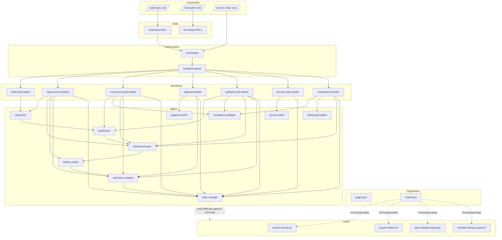

# Pass 0: Inventory — research-factory engine

> Scope of record: `/Users/jmagady/Dev/research-factory/plugins/research-factory/` (the plugin = the engine).
> Design context read for orientation only (not inventoried as code): `BUILD-PLAN.md`, `README.md`, `CLAUDE.md`, `CHANGELOG.md` at repo root.
> All metrics re-derived with `find … -exec wc -l {} +` (not estimated).

## What this artifact is

The engine ships as a **Claude Code plugin** (`plugin.json` v0.9.0, MIT, name `research-factory`). It is **pipeline-as-data**: behavior lives in declarative `.lobster` workflow DAGs + Markdown-as-agent prompt files, validated by a tiny Python ordering tool and guarded by deterministic Bash PreToolUse hooks. There is essentially **no application runtime code** — the "program" is the orchestration contract. A new market is config + seed, never new code.

---

## Tech Stack

| Format / Lang | Where | Used for |
|---|---|---|
| **Markdown-as-agent** (`.md` with YAML frontmatter) | `agents/`, `commands/`, `skills/*/SKILL.md`, `rules/` | The actual behavioral spec: 11 subagent prompts, 3 slash-command entry points, 2 user-invocable skills, 1 protocol rule. Frontmatter declares `name`/`model`/`tools`/`description`. |
| **Lobster DSL** (`.lobster`, YAML-shaped) | `workflows/` | 7 pipeline-as-data DAGs. Steps typed `agent` / `loop` / `gate` / `human-approval`, wired by `depends_on`, carrying `convergence{}`, `context.exclude` (info-asymmetry walls), `on_cap`/`on_capped_exit`. |
| **Python 3** | `bin/lobster-parse` (147 LOC, executable) | The DSL validator/orderer: schema check, cycle detection, Kahn topological order. Subcommands `validate` / `order` / `steps`. The only general-purpose code in the plugin. |
| **Bash** | `bin/factory-config.sh` (109), `hooks/*.sh` (4 files, 227), `tests/run-all.sh` (21) | Config validation; 4 fail-closed PreToolUse:Write gates; test runner. Hooks read tool-call JSON on stdin via `jq`. |
| **YAML** | `templates/factory.config.template.yaml`, `templates/github-action-templates/*.yml`, `templates/portfolio/manifest.yaml` | Instance config template; 6 GitHub Action workflow templates; portfolio manifest. |
| **JSON** | `.claude-plugin/plugin.json`, `hooks/hooks.json`, `templates/github-action-templates/mcp.json` | Plugin manifest (registers metadata); hook wiring (PreToolUse:Write → 4 scripts); MCP server config template. |
| **bats** | `tests/*.bats` (4 files, 327 LOC) | Behavioral tests for config, hooks (two suites incl. `hooks-v05`), and lobster DAG validation. |

Key external dependencies: `jq` (hooks + config script), `python3` (lobster-parse), `bats` (tests). No package manifest / lockfile — the plugin has no compiled or installed dependency tree.

---

## File Manifest (by directory, with priority tier)

Priority scale: **P0** entry/wiring · **P1** config-of-record · **P2** core behavior · **P3** interface · **P4** tests · **P5** templates/docs.

### `.claude-plugin/` — manifest (P0)
| Path | Lines | Priority | What it is |
|---|---|---|---|
| `.claude-plugin/plugin.json` | 19 | **P0** | Plugin manifest: name `research-factory`, v0.9.0, MIT. Registers the plugin; agents/commands/skills/hooks auto-discovered by directory convention. |

### `hooks/` — fail-closed gates (P0 wiring + P2 logic)
| Path | Lines | Priority | What it is |
|---|---|---|---|
| `hooks/hooks.json` | 15 | **P0** | Wires 4 scripts to **PreToolUse:Write**, each `timeout 5`, via `${CLAUDE_PLUGIN_ROOT}`. |
| `hooks/protect-secrets.sh` | 26 | **P2** | Blocks writing any credential (provider key prefixes, private keys, GH/AWS tokens) to any file. |
| `hooks/require-citation.sh` | 103 | **P2** | Iron-Law P3/P4 gate: blocks `/corpus/*.md` claim docs lacking a source marker or explicit unsourced-flag. |
| `hooks/layer-discipline-guard.sh` | 59 | **P2** | Layer spine: reads `layer`/`layer-observes` frontmatter, blocks if L_n doesn't observe L_(n-1). |
| `hooks/forbidden-phrase-guard.sh` | 39 | **P2** | Narrow observe-only integrity gate: blocks first-person/company-positioning/"what we should build" in corpus docs. |

### `commands/` — slash-command entry points (P0/P3)
| Path | Lines | Priority | What it is |
|---|---|---|---|
| `commands/build-track.md` | 8 | **P0** | `/build-track <track-slug>` → invokes the build-track **skill**. |
| `commands/init-market.md` | 8 | **P0** | `/init-market <slug>` → invokes the init-market **skill**. |
| `commands/pm-doc-chain.md` | 9 | **P0** | `/pm-doc-chain <finding>` → runs `pm-doc-chain.lobster` via orchestrator + pm-doc-writer (human-gated). |

### `bin/` — tooling (P2)
| Path | Lines | Priority | What it is |
|---|---|---|---|
| `bin/lobster-parse` | 147 | **P2** | Python DSL validator/orderer (validate/order/steps; schema + cycle + Kahn topo). The orchestrator runs this first. |
| `bin/factory-config.sh` | 109 | **P2** | Bash `factory.config.yaml` validator (`validate <config>`). |

### `agents/` — 11 subagents (P2, the core behavioral spec)
| Path | Lines | Model | What it is |
|---|---|---|---|
| `agents/orchestrator.md` | 39 | sonnet | Coordinator: parses .lobster, dispatches agents in `depends_on` order, runs convergence loop, enforces info-asymmetry walls. **No Write tool by design.** |
| `agents/researcher.md` | 62 | sonnet | Drafts L1/L2 observations from sources (effort-scaled fan-out). |
| `agents/synthesizer.md` | 54 | sonnet | Produces L3 findings + mandatory vector-coverage table; cross-track / portfolio synthesis. |
| `agents/editorial-sweeper.md` | 41 | haiku | Nuanced observe-only sweep (superlatives, mandate-path, attributed judgment) the hook can't do. |
| `agents/citation-verifier.md` | 39 | opus | Source-faithfulness pass; sees claim+source only (info-asymmetry). |
| `agents/adversary-reviewer.md` | 38 | opus | Adversarial reviewer in the convergence loop; never sees prior passes/drafter reasoning. |
| `agents/judgment-writer.md` | 40 | opus | L5 judgment layer (the first opinion-bearing layer). |
| `agents/consistency-validator.md` | 37 | haiku | Cross-doc consistency checks (cross-track/portfolio/maintenance). |
| `agents/dashboard-builder.md` | 36 | haiku | Builds dashboards/status views (maintenance). |
| `agents/pm-doc-writer.md` | 82 | opus | Drives the PM productization ladder (concept→6-pager→PRD→stories→acceptance). |
| `agents/state-manager.md` | 53 | haiku | **Sole committer**, runs last; writes `.factory/STATE.md` and the atomic commit. |

### `workflows/` — 7 lobster DAGs (P2)
| Path | Lines | What it is |
|---|---|---|
| `workflows/build-track.lobster` | 69 | The core loop: draft→synthesize→editorial-sweep→citation-verify→adversary-review(loop, cap 6)→gate→commit. |
| `workflows/ingest-source.lobster` | 58 | Ingest one external source into the corpus. |
| `workflows/cross-track-synth.lobster` | 60 | L4 cross-track synthesis. |
| `workflows/judgment.lobster` | 41 | L5 judgment workflow. |
| `workflows/portfolio-synth.lobster` | 71 | L6 portfolio synthesis (the newest, 7th workflow). |
| `workflows/pm-doc-chain.lobster` | 75 | PM ladder (5× pm-doc-writer, human-gated steps). |
| `workflows/maintenance.lobster` | 33 | Periodic consistency/dashboard maintenance. |

### `skills/` — user-invocable (P3)
| Path | Lines | What it is |
|---|---|---|
| `skills/build-track/SKILL.md` | 45 | The v0.1 acceptance workhorse: drive one track to adversary PASS; encodes the "Iron Law" + capped-exit honesty. |
| `skills/init-market/SKILL.md` | 54 | Stand up a new instance = config + seed (P10); interview, write config/seed, install Action templates, init state, register in portfolio. |

### `rules/` — protocol (P3)
| Path | Lines | What it is |
|---|---|---|
| `rules/research-protocol.md` | 45 | Shared research/citation protocol referenced across agents. |

### `templates/` — instance scaffolding (P5)
| Path | Lines | What it is |
|---|---|---|
| `templates/factory.config.template.yaml` | 79 | **Config-of-record template (P1)** — the per-market knob surface. |
| `templates/portfolio/manifest.yaml` | 28 | Portfolio registry for multi-market instances. |
| `templates/corpus/README.md` | 46 | Corpus folder orientation. |
| `templates/corpus/L2-baseline.md` / `-tldr.md` | 73 / 42 | L2 baseline doc templates. |
| `templates/corpus/L3-findings.md` / `-tldr.md` | 63 / 44 | L3 findings + vector-coverage templates. |
| `templates/corpus/L4-cross-track-synthesis.md` | 54 | L4 synthesis template. |
| `templates/corpus/L6-portfolio-synthesis.md` | 80 | L6 portfolio template. |
| `templates/corpus/track-summary.md` | 60 | Per-track summary template. |
| `templates/pm/{concept-narrative,six-pager,prd,user-stories,acceptance-plan}.md` | 22/26/48/22/25 | PM ladder doc templates. |
| `templates/github-action-templates/nightly-research.yml` | 157 | Nightly build-track Action. |
| `templates/github-action-templates/portfolio-rollup.yml` | 172 | Portfolio L6 rollup Action. |
| `templates/github-action-templates/on-pr-review.yml` | 138 | Cross-family adversary/citation PR review Action. |
| `templates/github-action-templates/ingest.yml` | 65 | Source-ingest Action. |
| `templates/github-action-templates/weekly-maintenance.yml` | 56 | Maintenance Action. |
| `templates/github-action-templates/mcp.json` | 16 | MCP server config template. |
| `templates/instance-docs/review-spec.md` | 119 | Generic cross-family review spec dropped into instances. |

### `docs/` — operator orientation (P5)
| Path | Lines | What it is |
|---|---|---|
| `docs/FACTORY.md` | 101 | Cold-start operator orientation. |
| `docs/LAYER-MODEL.md` | 38 | L1–L6 layer model. |
| `docs/AUTONOMY.md` | 35 | Autonomy levels / budget. |
| `docs/HOOKS.md` | 32 | The gate contract. |
| `docs/FACTORY-SOUL.md` | 28 | The constitution (P1–P10). |

### `tests/` — bats suites (P4)
| Path | Lines | What it is |
|---|---|---|
| `tests/lobster.bats` | 98 | Validates lobster DAGs (schema, cycles, order). |
| `tests/hooks.bats` | 81 | Hook behavior (citation, layer, secrets, forbidden-phrase). |
| `tests/hooks-v05.bats` | 69 | Additional v0.5 hook cases. |
| `tests/config.bats` | 79 | factory-config.sh validation cases. |
| `tests/run-all.sh` | 21 | Suite runner. |

---

## Dependency Graph (component level)



### Wiring facts (verified from source)

**Manifest registration.** `plugin.json` declares only metadata; agents/commands/skills/hooks are discovered by directory convention. `hooks.json` is the explicit wiring: PreToolUse matcher `Write` → 4 scripts in order `protect-secrets → require-citation → layer-discipline-guard → forbidden-phrase-guard`, each `timeout 5`, referenced via `${CLAUDE_PLUGIN_ROOT}`.

**Commands → skills/workflows.** `build-track.md` and `init-market.md` defer to their same-named SKILL. `pm-doc-chain.md` runs `pm-doc-chain.lobster` directly via the orchestrator + `pm-doc-writer`.

**Orchestrator → bin.** Orchestrator runs `${CLAUDE_PLUGIN_ROOT}/bin/lobster-parse validate <wf>` then `order <wf>` before dispatching; refuses invalid workflows. It holds no Write tool by design.

**Workflow → agent fan-in** (extracted via `agent:` keys):
- `build-track`: researcher → synthesizer → editorial-sweeper → citation-verifier → adversary-reviewer(loop) → state-manager
- `ingest-source`: researcher, editorial-sweeper, citation-verifier, adversary-reviewer, state-manager
- `cross-track-synth` & `portfolio-synth`: synthesizer, consistency-validator, editorial-sweeper, adversary-reviewer, state-manager
- `judgment`: judgment-writer, adversary-reviewer, state-manager
- `pm-doc-chain`: pm-doc-writer ×5 (the ladder), state-manager
- `maintenance`: consistency-validator, editorial-sweeper, dashboard-builder, state-manager

**Convergence contract** (in `build-track.lobster`): `loop` step `adversary-review` with `novelty_threshold: 0.15`, `clean_passes_required: 3`, `max_passes: 6`, `on_cap: commit-flagged`; a `gate` step with `pass_when: "(ADVERSARY_VERDICT == PASS and MUST_FIX_REMAINING == 0) or LOOP_CAPPED == true"` and `on_capped_exit.flag_pr`. `context.exclude` enforces info-asymmetry (reviewers never see `prior-review-passes`, `drafter-reasoning`, `orchestrator-summary`).

**Model assignment** (from agent frontmatter): opus = adversary-reviewer, citation-verifier, judgment-writer, pm-doc-writer (the adversarial/judgment-bearing roles); sonnet = orchestrator, researcher, synthesizer; haiku = state-manager, editorial-sweeper, consistency-validator, dashboard-builder. Note: builder vs. reviewer model-family separation (P6) is realized at the GitHub-Action layer (cross-family CLI), not purely in these frontmatters.

---

## File Prioritization Scoring

| Tier | Score | Files | What |
|---|---|---|---|
| Entry / wiring | **P0** | `plugin.json`, `hooks.json`, `commands/*.md` (3) | Registers and routes everything. Read first in Pass 1. |
| Config-of-record | **P1** | `templates/factory.config.template.yaml` | The per-market knob surface; defines what is configurable vs. hardcoded (P10 test). |
| Core behavior | **P2** | `agents/*.md` (11), `workflows/*.lobster` (7), `bin/lobster-parse`, `bin/factory-config.sh`, `hooks/*.sh` (4) | The actual pipeline contract + gates + validator. |
| Interface | **P3** | `skills/*/SKILL.md` (2), `rules/research-protocol.md` | User-invocable surface + shared protocol. |
| Tests | **P4** | `tests/*.bats` (4), `tests/run-all.sh` | Behavioral truth source for hooks, config, lobster. |
| Templates / docs | **P5** | `templates/corpus|pm|github-action-templates|portfolio|instance-docs/*`, `docs/*.md` (5) | Scaffolding + operator orientation. |

---

## Counts & LOC (re-derived via `find … -exec wc -l {} +`)

| Type | Files | Total LOC |
|---|---:|---:|
| Markdown (`.md`) | 36 | 1,648 |
| Lobster (`.lobster`) | 7 | 407 |
| YAML (`.yaml`/`.yml`) | 7 | 695 |
| Bash (`.sh`) | 6 | 357 |
| bats (`.bats`) | 4 | 327 |
| JSON (`.json`) | 3 | 50 |
| Python (`bin/lobster-parse`, no ext) | 1 | 147 |
| **Total** | **64** | **~3,631** |

Notes: `.sh` total (357) includes `tests/run-all.sh` (21) + 4 hooks (227) + `factory-config.sh` (109). `lobster-parse` (Python, 147) has no extension and is counted separately, so it is not in the `.sh` figure. Markdown LOC (1,648) is dominated by agents (521) + templates corpus/pm (~659) + docs (234) + skills/commands/rules (169). Sum of category totals = 3,631; the 64 files cover every file under the plugin (no generated/vendor dirs present).

Per-component LOC: agents 521 · workflows 407 · hooks 227 (+`hooks.json` 15) · bin 256 · skills 99 · commands 25 · rules 45 · docs 234 · tests 348 · templates/corpus 462 · templates/pm 143 · templates/github-action-templates 604 · templates/portfolio 28 · templates/instance-docs 119 · config template 79 · plugin.json 19.

---

## Resume checkpoint

```yaml
pass: 0
status: complete
files_scanned: 64
total_loc: 3631
languages: [markdown-as-agent, lobster-dsl, python, bash, yaml, bats, json]
components: {agents: 11, workflows: 7, hooks: 4, bin: 2, skills: 2, commands: 3, rules: 1}
timestamp: 2026-06-01T00:00:00Z
next_pass: 1
next_pass_name: Architecture
```

## Remaining gaps / next candidate scope (for Pass 1+)

1. **Lobster step-type semantics** — Pass 1 should fully model the 4 step types (`agent`/`loop`/`gate`/`human-approval`) and the convergence/capped-exit state machine. `lobster-parse` only validates DAG + topo order, not runtime semantics; the semantics live distributed across `orchestrator.md` + each workflow's inline comments. Reconcile these.
2. **Builder≠reviewer cross-family wall (P6)** — agent frontmatter alone does not enforce different model *families*; the GitHub-Action templates (`on-pr-review.yml`, `nightly-research.yml`) and `mcp.json` appear to carry the cross-family CLI dispatch. Pass 1 should trace where Claude-side vs. CLI-side execution splits.
3. **Hook coverage vs. agent overlap** — `forbidden-phrase-guard` (deterministic, narrow) vs. `editorial-sweeper` (reasoning, broad): map the exact division of labor and the exempt-path logic (`templates/_meta/seed/index/readme`) for the layer/citation gates.
4. **factory.config.template.yaml knob surface (P1)** — Pass 2 (domain) should enumerate every config key and which engine behavior it parameterizes, to validate the "config + seed, never code" invariant (P10).
5. **State model** — `.factory/STATE.md` lives on the orphan `factory-artifacts` branch (gitignored on main) and is **not in this tree**; only `state-manager.md` describes it. Pass 1 must treat the state-branch round-trip (CI restore/persist) as an external boundary.
6. **Portfolio/L6** — `portfolio-synth.lobster` + `L6-portfolio-synthesis.md` + `portfolio/manifest.yaml` are the newest additions (engine v0.9.0 / repo v1.0 item #4); verify L6→L5 layer discipline and multi-market manifest wiring in Pass 2/3.
