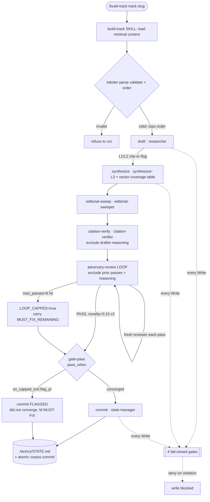
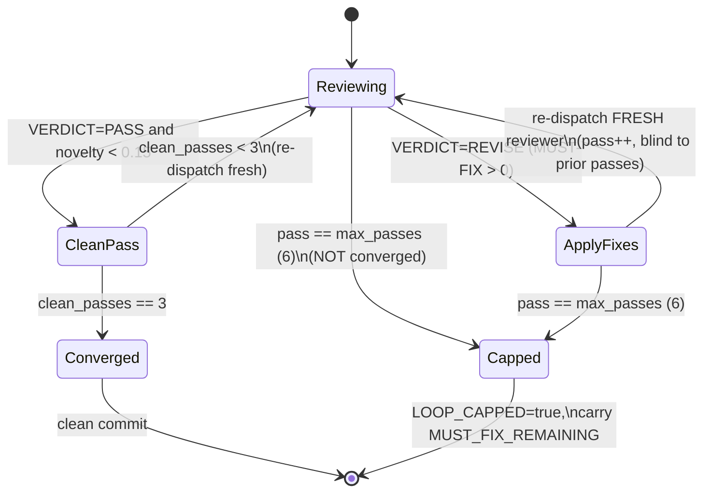
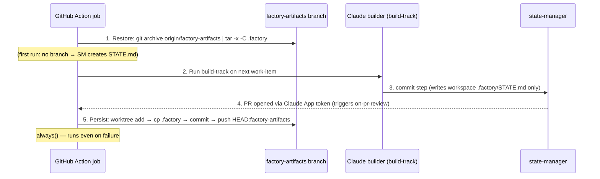

# Pass 1: Architecture — research-factory engine

> Scope of record: `/Users/jmagady/Dev/research-factory/plugins/research-factory/` (the plugin = the engine).
> Builds on Pass 0 inventory (64 files, ~3,631 LOC). Design context: `BUILD-PLAN.md`, `CLAUDE.md`, `docs/FACTORY-SOUL.md`.
> Every claim below is grounded in source read this pass (orchestrator, lobster-parse, 7 workflows, 4 hooks, 3 Action templates, 2 skills, config template, plugin.json). No fabrication.

## What the architecture *is*

The engine has **almost no runtime code**. The "program" is a contract distributed across four declarative substrates:
a Python DAG validator (`bin/lobster-parse`, 147 LOC — the only general-purpose code), Markdown-as-agent prompt files
(the behavioral spec), `.lobster` YAML DAGs (the pipeline-as-data), and Bash PreToolUse hooks (the deterministic gates).
**Orchestration is interpreted by an LLM agent (`orchestrator.md`) reading those declarations**, not by a scheduler.
This is the single most important architectural fact: the contract is *enforced structurally* (hooks fail-closed, lobster-parse
refuses invalid DAGs, info-asymmetry via `context.exclude`) but *executed by reasoning* (the orchestrator dispatches sub-agents).

There are **two execution surfaces** with a deliberate split of where each constitutional invariant is realized:
local Claude Code plugin invocation (single model family, hooks active) and GitHub Actions (multi-family CLIs, the builder≠reviewer
wall realized at the CI layer). The engine ships once; a market is `factory.config.yaml` + `seed/`, never new code (P10).

---

## 1. Module boundaries & layers

The engine decomposes into **six architectural layers**, each with a single responsibility and a one-directional dependency on the layer above it. (These are *engine* layers — distinct from the L1–L6 *corpus content* layers, which are a domain concept covered in Pass 2.)

| # | Layer | Files | Responsibility | Boundary contract |
|---|---|---|---|---|
| A | **Registration / manifest** | `.claude-plugin/plugin.json` (19), `hooks/hooks.json` (15) | Declare plugin identity; wire the 4 PreToolUse:Write hooks. Everything else is discovered by directory convention (no explicit registry). | `plugin.json` carries metadata only. `hooks.json` is the *only* explicit wiring in the plugin: `PreToolUse` matcher `Write` → 4 scripts, ordered, each `timeout 5`, via `${CLAUDE_PLUGIN_ROOT}`. |
| B | **Entry / interface** | `commands/*.md` (3), `skills/*/SKILL.md` (2), `rules/research-protocol.md` (1) | User-invocable surface. Commands defer to same-named skills; `pm-doc-chain` command runs its workflow via the orchestrator. Skills encode the human-readable "Iron Law" + red-flag tables that the LLM follows. | A command is a thin router (8–9 LOC). A skill is the prose contract a human or the orchestrator executes. Neither holds a Write tool by itself. |
| C | **Orchestration** | `agents/orchestrator.md` (39), `bin/lobster-parse` (147), `bin/factory-config.sh` (109) | Decide *who runs next*. The orchestrator parses a workflow (via lobster-parse), dispatches agents in `depends_on` order, runs the convergence loop, enforces info-asymmetry, honors gates. lobster-parse is the deterministic DAG validator/orderer. | **The orchestrator has NO Write tool by design** (`tools: [Read, Grep, Glob, Bash]`). It coordinates only — never drafts, reviews, judges, or commits. lobster-parse validates *structure* (schema + DAG + topo order); it does **not** interpret runtime semantics (convergence, gates) — the orchestrator does. |
| D | **Workflow-DAG (pipeline-as-data)** | `workflows/*.lobster` (7) | Declare each pipeline as a typed DAG: steps wired by `depends_on`, carrying `convergence{}`, `context.exclude`, `on_cap`/`on_capped_exit`, `criteria.pass_when`. | A workflow is *data*, not code. Step types: `agent`/`skill`/`gate`/`human-approval`/`loop`/`parallel`/`sub-workflow` (the full STEP_TYPES set in lobster-parse; the 7 shipped workflows use `agent`/`skill`/`gate`/`human-approval`/`loop`). Adding a pipeline = adding a `.lobster` file, no engine code. |
| E | **Agent (behavioral spec)** | `agents/*.md` (11, minus orchestrator = 10 worker agents) | The actual work: research, synthesis, citation-verify, adversary review, judgment, PM docs, editorial sweep, consistency, dashboards, commit. Each is a frontmatter-typed sub-agent prompt (`name`/`model`/`tools`). | Each agent declares its *own* tool grant. Only `state-manager` and `pm-doc-writer`/researcher etc. that draft carry `Write`; **the adversary-reviewer and citation-verifier are read-only** (`tools: [Read, Grep, Glob]`) — info-asymmetry is enforced both by `context.exclude` and by the absence of Write. |
| F | **Deterministic-gate (fail-closed)** | `hooks/*.sh` (4) | Block-on-violation gates that run *before every Write*, deterministically, no LLM: secrets, citation-or-flag, layer discipline, forbidden-phrase. | Each hook reads the tool-call JSON on stdin via `jq`, emits a PreToolUse `allow`/`deny` envelope, runs <100ms. **Fail-closed**: a violating Write is denied regardless of which agent attempted it. Scope-narrowed to `*/corpus/*.md` (except protect-secrets, which guards *all* files). |
| G | **Templates / scaffolding** | `templates/` (corpus, pm, portfolio, github-action-templates, instance-docs), config template, `docs/` | Per-instance scaffolding: the config-of-record template (the knob surface), corpus/PM doc skeletons, the 6 GitHub Action templates, the cross-family review spec, the portfolio manifest. Plus operator docs. | This layer is *copied into an instance*, not executed in the engine. It is the materialization of "a market = config + seed." Hooks **exempt** `*/templates/*` so scaffolds with placeholder claims aren't blocked. |

**Layer dependency direction (one-way):** A (registration) is depended on by all; B (entry) → C (orchestration) → D (workflows) → E (agents). F (gates) is *cross-cutting* — it intercepts E's Write attempts independent of the call graph. G (templates) is referenced by B (skills install/scaffold from it) and is inert at engine runtime.

---

## 2. Component relationships & run flow

### How a build-track run flows (verified from source)

1. **Invocation.** `/build-track <track-slug>` (`commands/build-track.md`) → the `build-track` **skill** (`skills/build-track/SKILL.md`). The skill encodes the Iron Law and the red-flag table; it loads minimal context (`factory.config.yaml`, the track's index/TLDR only — *not* the whole corpus).
2. **Parse + order.** The orchestrator runs `${CLAUDE_PLUGIN_ROOT}/bin/lobster-parse validate build-track.lobster` then `... order build-track.lobster`. lobster-parse does schema check → `depends_on` resolution → cycle detection → **Kahn topological sort** (deterministic, ties broken by sorted name). It **refuses to emit an order for an invalid workflow** (`order` dies if `validate` failed). The orchestrator refuses to run an invalid workflow.
3. **Dispatch in dependency order.** For `build-track.lobster` the order is: `draft` (researcher) → `synthesize` (synthesizer) → `editorial-sweep` (editorial-sweeper) → `citation-verify` (citation-verifier) → `adversary-review` (loop) → `gate-pass` (gate) → `commit` (state-manager). Independent steps may run together (none here; build-track is a chain).
4. **Per-step info-asymmetry.** Before dispatching a reviewer, the orchestrator honors that step's `context.exclude`: `citation-verify` excludes `[drafter-reasoning, orchestrator-summary]`; `adversary-review` excludes `[prior-review-passes, drafter-reasoning, orchestrator-summary]`. The reviewer sees the artifact-as-written only.
5. **Convergence loop.** `adversary-review` (`type: loop`) re-dispatches a *fresh* adversary each pass, applying MUST-FIX between passes, until `VERDICT: PASS` with novelty `< 0.15` for `3` consecutive clean passes — **or** `max_passes: 6`, whichever first. A cap hit sets `LOOP_CAPPED = true`, carries `MUST_FIX_REMAINING`, and is **not** a failure.
6. **Gate.** `gate-pass` evaluates `pass_when: "(ADVERSARY_VERDICT == PASS and MUST_FIX_REMAINING == 0) or LOOP_CAPPED == true"`. On a capped exit it does **not** abort: `on_capped_exit.flag_pr` text is passed downstream so the commit/PR is flagged "did not fully converge."
7. **Commit.** `commit` (state-manager) runs **last** — the sole committer. One burst → one atomic commit. It verifies the review record exists, updates `.factory/STATE.md`, and commits the corpus change + state together.

### Mermaid — architecture (component view)

```mermaid
graph TD
    subgraph A["A · Registration"]
      MANIFEST[plugin.json]
      HOOKSJSON[hooks.json]
    end
    subgraph B["B · Entry / Interface"]
      CMD["commands/*.md (3)"]
      SK_BT[build-track SKILL]
      SK_IM[init-market SKILL]
      RULE[research-protocol rule]
    end
    subgraph C["C · Orchestration"]
      ORCH["orchestrator.md (NO Write)"]
      LP["bin/lobster-parse (Kahn topo)"]
      CFG["bin/factory-config.sh"]
    end
    subgraph D["D · Workflow DAGs"]
      WF["7 .lobster workflows"]
    end
    subgraph E["E · Agents (10 workers)"]
      DRAFT["researcher / synthesizer / judgment-writer / pm-doc-writer (Write)"]
      REVIEW["adversary-reviewer / citation-verifier (READ-ONLY)"]
      SWEEP["editorial-sweeper / consistency-validator / dashboard-builder"]
      SM["state-manager (sole committer)"]
    end
    subgraph F["F · Deterministic gates (PreToolUse:Write)"]
      H_SEC[protect-secrets]
      H_CITE[require-citation]
      H_LAYER[layer-discipline-guard]
      H_FORB[forbidden-phrase-guard]
    end
    subgraph G["G · Templates / scaffolding"]
      T_CORP[corpus + pm skeletons]
      T_GHA[6 GitHub Action templates]
      T_CFG[factory.config template]
      T_MAN[portfolio manifest]
    end

    CMD --> SK_BT & SK_IM
    SK_BT --> ORCH
    SK_IM --> T_CFG & T_GHA & T_MAN
    ORCH --> LP
    ORCH -. validate config .-> CFG
    LP --> WF
    ORCH -. dispatch in depends_on order .-> E
    REVIEW -. blind: context.exclude .-> ORCH
    HOOKSJSON -. PreToolUse:Write .-> F
    E == every Write intercepted ==> F
    SM --> T_CORP
    MANIFEST -. discovered by convention .-> B & C & E
```

### Mermaid — data flow (a build-track run)



---

## 3. The Lobster step-type & convergence state machine

This resolves **gap #1** from Pass 0: lobster-parse validates *structure*; the orchestrator interprets *runtime semantics*. Reconciliation below.

### 3.1 Step types — validated vs. interpreted

`lobster-parse` (line 20) recognizes **7 step types**: `{agent, skill, gate, human-approval, loop, parallel, sub-workflow}`. Of these, `TYPE_REQUIRES` (line 21) enforces a referenced-field constraint at validate time: `agent` requires `agent:`, `skill` requires `skill:`, `sub-workflow` requires `workflow:`. The other four (`gate`, `human-approval`, `loop`, `parallel`) carry **no parser-enforced required field** — their semantics live entirely in the orchestrator + inline workflow comments.

| Step type | What lobster-parse validates | What the orchestrator interprets at runtime | Used in shipped workflows |
|---|---|---|---|
| `agent` | must carry `agent:`; name unique; `depends_on` resolves | dispatch the named sub-agent after deps complete; honor `context.exclude`, `timeout`, `on_failure` | all 7 (draft/synthesize/commit/etc.) |
| `skill` | must carry `skill:` | run the named skill (e.g. `capture-source`, `load-instance-outputs`, `load-track-summaries`) | ingest-source, cross-track-synth, portfolio-synth |
| `loop` | type-in-set only (no required field) | run the convergence loop: re-dispatch a fresh `agent:` each pass until converged or capped (§3.2) | all review-bearing workflows |
| `gate` | type-in-set only | evaluate `criteria.pass_when` (or a `criteria:` map of `clear` flags for pm-doc-chain); stop unless met, **unless** `on_capped_exit` and the prior loop capped | build-track, pm-doc-chain |
| `human-approval` | type-in-set only | **stop and surface for human sign-off**; never self-approve; `required: true` makes it non-skippable | judgment, portfolio-synth, cross-track-synth, pm-doc-chain |
| `parallel` | in the type set | (not used by shipped workflows; orchestrator would fan out) | — |
| `sub-workflow` | must carry `workflow:` | (not used by shipped workflows; would recurse into another DAG) | — |

**Reconciliation finding:** there is a deliberate *thin-validator / thick-interpreter* split. lobster-parse is intentionally dumb (deterministic, no LLM, 147 LOC) — it guarantees the DAG is *well-formed and acyclic* so the orchestrator can trust the order. All *behavioral* meaning (convergence math, gate predicates, info-asymmetry, capped-exit honesty) is carried in `orchestrator.md` §How-you-run-a-workflow (steps 3–7) and re-stated in each workflow's inline comments. The bats suite (`tests/lobster.bats`) tests the validator; the agents tests the interpreter behavior.

### 3.2 The convergence state machine (the heart of the engine)

The `loop` step's `convergence{}` block is identical across all five review-bearing workflows: `novelty_threshold: 0.15`, `clean_passes_required: 3`, `max_passes: 6`. The differentiator is `on_cap`.

**State machine for an `adversary-review` loop step:**



- **Novelty metric:** `novelty = new / (new + dup)` findings per pass (orchestrator step 4). The loop converges when novelty stays `< novelty_threshold` for `clean_passes_required` *consecutive* passes — i.e. the adversary keeps finding the same (or no) issues, not new ones.
- **Freshness invariant:** each pass re-dispatches a *fresh* reviewer that never sees prior passes (`context.exclude: [prior-review-passes]`). "Previously converged ≠ correct" — the blindness is the blind-spot-catching mechanism (P7 + P6).
- **The cap (P7 honesty):** `max_passes: 6` is a *hard* cap. A heavily-flawed draft can thrash forever; without the cap an unattended night-shift run "would otherwise burn the whole job timeout and commit nothing." So at the cap the loop **stops, commits what it has, and flags the result** — a loud honest fallback, explicitly *not* a license to bail early (the skill's Iron Law: "you still loop to the cap").

### 3.3 `on_cap` dispatch — two capped-exit paths

| `on_cap` value | Workflows | Capped-exit behavior |
|---|---|---|
| `commit-flagged` | build-track, ingest-source | Commit anyway, but flag the PR "did not fully converge — M MUST-FIX remain after N passes." The `gate-pass` step's `on_capped_exit.flag_pr` carries the text. Autonomy-3 night-shift relies on this so unattended runs never silently no-op. |
| `surface-to-human` | judgment, cross-track-synth, portfolio-synth | These workflows are *already* human-gated (a `human-approval` step follows the loop). On cap, carry the unconverged status ("loop hit max_passes with M MUST-FIX remaining") **into the approval prompt** — the human decides: approve, revise, or drop. |

### 3.4 Gate `pass_when` expressions — two gate idioms

There are **two distinct gate styles** in the shipped workflows:

1. **Boolean predicate gate** (build-track `gate-pass`):
   `pass_when: "(ADVERSARY_VERDICT == PASS and MUST_FIX_REMAINING == 0) or LOOP_CAPPED == true"`.
   The `or LOOP_CAPPED == true` disjunct is what makes the capped exit pass the gate (paired with `on_capped_exit.flag_pr` to flag it). The orchestrator evaluates this expression against loop outputs.
2. **Criteria-map gate** (pm-doc-chain `dev-readiness-check`): a `criteria:` map of named readiness fields each required `clear` (`MVF_SCOPE: clear`, `INPUTS_OUTPUTS: clear`, `STATE_TRANSITIONS: clear`, `INTEGRATION_ALERTING`, `DEPENDENCIES`, `STORY_DERIVATION_CRITERIA`, `QA_ACCEPTANCE_CRITERIA`). Any one unclear blocks handoff — resolved as a labeled Assumption + Open Question, "not invention."

Both are *interpreted* by the orchestrator/skill, not parsed by lobster-parse (the parser never looks inside `criteria`).

---

## 4. Deployment topology — two execution surfaces

This resolves **gap #2** from Pass 0: where the Claude-side vs. CLI-side execution splits, and where the builder≠reviewer cross-family wall is *actually* realized.

### Surface (a) — local Claude Code plugin

- **Trigger:** a human runs `/build-track`, `/init-market`, or `/pm-doc-chain` in Claude Code with the plugin enabled.
- **Execution:** a single Claude session. The orchestrator dispatches sub-agents (`Task`-style) all within the **same model family**. The adversary-reviewer's frontmatter even says so: *"the in-Claude form is the local fallback … locally you stand in for it."*
- **Gates active:** all 4 PreToolUse:Write hooks fire (they're plugin-native via `hooks.json`).
- **State:** the state-manager writes `.factory/STATE.md` and commits the `factory-artifacts` branch directly (`cd .factory && git add … && git commit && git push origin factory-artifacts`).
- **Limitation:** cross-family cognitive diversity (P6) is **simulated**, not structural — same family plays both builder and adversary. This is acknowledged as a fallback.

### Surface (b) — GitHub Actions (the real cross-family enforcement)

Six Action templates (`templates/github-action-templates/`) installed into an instance / the portfolio repo. The **builder≠reviewer wall is realized here at the CLI level**, not in agent frontmatter:

| Action | Trigger | Who runs | Family | Role |
|---|---|---|---|---|
| `nightly-research.yml` | cron `0 7 * * *` + dispatch | `anthropics/claude-code-action@v1`, `--model claude-sonnet-4-6` | **Claude** | the *builder* — runs build-track, drafts, commits, opens PR. Never auto-merges (autonomy 3). |
| `on-pr-review.yml` | `pull_request` opened/sync/reopen | `openai/codex-action@v1`, `model: gpt-5.5`, `sandbox: read-only` | **OpenAI Codex** | the *adversary* — 6-dimension review against `docs/review-spec.md`, diff-scoped. |
| `on-pr-review.yml` (2nd job) | same PR event | `google-github-actions/run-gemini-cli@v0` | **Gemini** | the *citation-verifier* — source-faithfulness (SUPPORTED/PARTIAL/UNSUPPORTED/CONTRADICTED/UNREACHABLE). |
| `portfolio-rollup.yml` | cron Mon `0 9 * * 1` | Claude builder | Claude | drafts the L6 brief (portfolio repo). Always human-gated. |
| `ingest.yml` | source-ingest | Claude builder | Claude | runs ingest-source. |
| `weekly-maintenance.yml` | weekly cron | Claude builder | Claude | runs maintenance, opens PR. |

**The cross-family wall (P6) is structural at the CI layer:** the Claude builder authors the PR; **two different model families (Codex + Gemini) review the diff** and post findings as PR comments. The review is a *gate, not a merge* — humans merge (autonomy 3). Three independent families touch the artifact (Claude builds, Codex adversary-reviews, Gemini citation-verifies). Cognitive diversity is enforced by *which CLI runs*, which agent frontmatter alone cannot guarantee.

**Diff-scoping discipline:** each reviewer is told exactly which files the PR changed (`gh pr diff --name-only`) and reviews only those — "otherwise the reviewer has the whole checkout but no scope and no-ops."

**No-black-box rule:** every CLI uploads its full output as an artifact (`claude-execution-log`, `codex-review-log`) *and* posts findings as a PR comment. `show_full_output` is OFF on the Claude action to avoid echoing secrets into the run log; the safe capture is the artifact.

### The CI state round-trip (`factory-artifacts` branch)

`.factory/STATE.md` is **not in the code tree** — it lives on the orphan `factory-artifacts` branch (gitignored on `main`). The Action owns the round-trip; the state-manager only *writes* the workspace file (it must NOT fetch/commit/push the branch in CI — that double-handles it). Mirror steps in both nightly-research and portfolio-rollup:



Two CI subtleties verified in source: (1) the Claude **App token** (not `GITHUB_TOKEN`) is used so the push can touch `.github/workflows/` ranges *and* so opening the PR triggers `on-pr-review` (a `GITHUB_TOKEN`-authored PR would not trigger another workflow). (2) A **fallback PR opener** detects the branch Claude pushed (because `branch_name` output is empty for Bash pushes) and ensures a PR exists, staying neutral on convergence (it can't read the loop outcome).

---

## 5. Cross-cutting concerns

| Concern | Mechanism | Where realized | Failure mode |
|---|---|---|---|
| **Info-asymmetry walls (P6)** | `context.exclude` on review steps (`prior-review-passes`, `drafter-reasoning`, `orchestrator-summary`) + read-only tool grants on adversary/citation agents + the structural CLI-family split in CI. | workflows (`exclude:`), agent frontmatter (`tools:`), `on-pr-review.yml`. | The orchestrator is instructed *not to narrate around* the walls; "previously converged ≠ correct." |
| **Fail-closed Write gate chain** | 4 PreToolUse:Write hooks, ordered `protect-secrets → require-citation → layer-discipline-guard → forbidden-phrase-guard`, each `timeout 5`, emitting `allow`/`deny` JSON. | `hooks.json` + `hooks/*.sh`. | **Deny on violation, regardless of agent.** A missing `jq` makes a hook `exit 1` (the hook itself fails closed by erroring out). |
| **Layer discipline (L_n cites L_(n-1))** | `layer-discipline-guard.sh` reads `layer`/`layer-observes` frontmatter; blocks if `layer-observes != L_(n-1)`. L1 must observe `external`/empty/`L0`. | hook (deterministic) + adversary dimension #2 (reasoning) + `require-citation`'s downward-cite acceptance (`.md` reference / `[[wikilink]]`). | A doc with a `layer:` tag but wrong/missing `layer-observes:` is **denied**. No layer tag → not this guard's concern (other guards still apply). |
| **Cite-or-flag-or-drop (P3/P4)** | `require-citation.sh`: a `*/corpus/*.md` doc with ≥3 substantive prose lines must contain a citation (`https?://`, `[^footnote]`, `[[wikilink]]`, `*.md` ref) **or** an explicit flag (`[Source needed`, `[Access required`, `[unsourced`, `[citation needed`) **or** frontmatter `cites:/source:/sources:`. | hook + researcher/citation-verifier behavior + ingest-source `on_failure: flag-access-required`. | Substantive corpus claim with neither citation nor flag → **denied** ("anchor-not-strip": flag, don't silently delete). Type-2 (AI-invented) content is dropped by agents, not the hook. |
| **Observe-and-report integrity (P5)** | Two-tier: `forbidden-phrase-guard.sh` (narrow bright-line: "we should build", "the moat is", "pick a winner") deterministically; `editorial-sweeper` agent for the nuanced sweep (superlatives, mandate-path, attributed judgment) the hook can't do. | hook (precision) + agent (recall). | Bright-line positioning phrase in a corpus doc → **denied**, reframe as sourced observation or move to L5. |
| **Secrets hygiene** | `protect-secrets.sh` matches high-precision secret signatures (`sk-`, `pplx-`, `tvly-`, `gh[pousr]_`, `AKIA…`, PEM private keys, `xox…`) on **every** Write (not corpus-scoped). Keys live in GitHub Secrets/OIDC; `.mcp.json`/`.env` gitignored. | hook + state-manager boundary + all Action `env:` blocks reference `${{ secrets.* }}`. | Secret-shaped token in any Write → **denied**. CI never sets a literal `$VAR` in MCP settings env (would override the inherited real key). |
| **Sole-committer rule (P8)** | `state-manager` is the only agent with `Write`+`Bash`+git that runs **last**; orchestrator has **no Write**; one burst → one atomic commit. | `state-manager.md` Iron Law + orchestrator step 7 + every workflow's `commit` step depending on the prior gate. | Committing mid-burst would cause citation/version races; the state-manager refuses to commit if review verdicts aren't recorded. |
| **Autonomy / human gates** | `autonomy_level: 3` (human gate on every merge). `always_human`: l5_judgment, l6_portfolio, pm_productization, publish. `human-approval` steps in judgment/portfolio/pm-doc-chain. | `factory.config` + workflow `human-approval` steps + Actions never auto-merging. | Irreversible/outward actions always human-gated; never self-approved. |
| **Budget governance** | `budget{}` in config: `per_run_cap`, cumulative `warn/alert/pause/hard_stop`, `on_critical_path_downgrade: pause`. | `factory.config.template.yaml`. | At hard_stop, refuse new agent dispatch; a forced model downgrade pauses rather than continues underpowered. |
| **Generic-engine / per-market config (P10)** | All market variability is in `factory.config.yaml` (vectors, tracks, sourcing, forbidden_phrases_extra) + `seed/`. Hooks carry only *generic* patterns; market-specific names go in `editorial.forbidden_phrases_extra`. | config template + `forbidden-phrase-guard.sh` comment explicitly defers market names to instance config. | If something can't be expressed in config + seed, **stop and surface the gap** (init-market Iron Law). |

---

## Component catalog (responsibilities, condensed)

| Component | Responsibility | Tool grant / model | Key boundary |
|---|---|---|---|
| orchestrator | dispatch in `depends_on` order, run convergence, enforce walls, honor gates | Read/Grep/Glob/Bash · sonnet · **no Write** | coordinate only |
| lobster-parse | validate schema + DAG, emit Kahn topo order | Python, no LLM | structure only, no semantics |
| factory-config.sh | validate `factory.config.yaml` | Bash | config-of-record gate |
| researcher | draft L1/L2 observations, effort-scaled fan-out | sonnet, Write | every claim cited or flagged |
| synthesizer | L3 findings + mandatory vector-coverage table; L4/L6 synthesis | sonnet, Write | cite the layer below |
| editorial-sweeper | nuanced observe-only sweep (recall side of P5) | haiku | reasoning the hook can't do |
| citation-verifier | source-faithfulness; sees claim+source only | opus · **read-only** | info-asymmetric |
| adversary-reviewer | 6-dimension adversarial review, fresh each pass | opus · **read-only** · CI=different family | never sees prior passes |
| judgment-writer | L5 judgment (first opinion layer); cites L4 | opus, Write | human-gated downstream |
| consistency-validator | cross-doc consistency (cross-track/portfolio/maintenance) | haiku | fresh context each run |
| dashboard-builder | dashboards/status views (maintenance) | haiku | |
| pm-doc-writer | PM ladder (concept→6-pager→PRD→stories→acceptance) | opus, Write | consumes L4/L5, adds no corpus claims |
| state-manager | sole committer, runs last, writes STATE.md | haiku, Write/Edit/Bash | one burst → one atomic commit |

---

## Resume checkpoint

```yaml
pass: 1
status: complete
files_read_this_pass: 19   # orchestrator, lobster-parse, 7 workflows, 4 hooks, hooks.json, 3 GHA templates, 2 skills, config template, plugin.json
architectural_layers: 7    # A registration · B entry · C orchestration · D workflows · E agents · F gates · G templates
execution_surfaces: 2      # local Claude plugin · GitHub Actions (cross-family CLIs)
step_types: 7              # agent skill gate human-approval loop parallel sub-workflow (4 used)
convergence: {novelty_threshold: 0.15, clean_passes_required: 3, max_passes: 6, on_cap: [commit-flagged, surface-to-human]}
cross_family_wall: realized-at-CI   # Claude builder · Codex adversary · Gemini citation-verify
gaps_resolved: [pass0-gap-1 lobster-step-semantics, pass0-gap-2 cross-family-wall]
timestamp: 2026-06-01T00:00:00Z
next_pass: 2
next_pass_name: Domain Model
```

## Remaining gaps / next candidate scope (for Pass 2+)

1. **L1–L6 corpus content model (Pass 2 core).** Pass 1 covered *engine* layers; Pass 2 must model the *domain* layers (L1 raw → L2 baseline → L3 findings+vector-coverage → L4 cross-track → L5 judgment → L6 portfolio), their frontmatter contract (`layer`, `layer-observes`, `tags`), and the downward-capped quality rule (L4 ≤ min(L3) ≤ min(L2)). Read `docs/LAYER-MODEL.md` + all `templates/corpus/*.md`.
2. **factory.config knob surface enumeration (P10 validation).** Pass 2 should enumerate every config key (identity, seed, vectors, tracks, editorial, review.convergence, autonomy_level, merge.auto_merge_when/always_human, budget, deliverables) and map each to the engine behavior it parameterizes — the empirical test of "config + seed, never code."
3. **Evidence-vector + track domain vocabulary.** Vectors (V1 vendor / V2 operator / V3 influencer in the template) and tracks are the per-market generalization; Pass 2 should model them as domain entities and the vector-coverage table (Strong/Moderate/Weak/None) as a value object.
4. **PM productization ladder as a domain pipeline.** concept-narrative → six-pager → PRD (7-section, MVF vs Future) → user-stories (7 fields) → acceptance-plan — entities + their human-gate transitions; templates in `templates/pm/`.
5. **State model entities.** `.factory/STATE.md` structure (phase, current step, decisions log, active branches, drift items, track build log) is described only in `state-manager.md`; Pass 2 should model it as the resume/state aggregate even though the live file is on `factory-artifacts` (external to this tree).
6. **Behavioral contracts from tests (Pass 3).** `tests/lobster.bats`, `tests/hooks.bats`, `tests/hooks-v05.bats`, `tests/config.bats` (327 LOC) are first-class spec inputs — extract preconditions/postconditions for the validator, the 4 hooks, and config validation. Not yet read.
7. **Portfolio manifest + load-instance-outputs skill.** `portfolio/manifest.yaml` schema (instances[].slug/repo/l4/l5 globs) and the manifest-driven cross-repo pull in `portfolio-rollup.yml` — verify L6→L5 cross-market layer discipline holds at the manifest level.
8. **rules/research-protocol.md + remaining 3 Action templates (ingest.yml, weekly-maintenance.yml, mcp.json) + 4 unread corpus/pm templates** — read for completeness in a Pass 0/1 deepening round.
```
