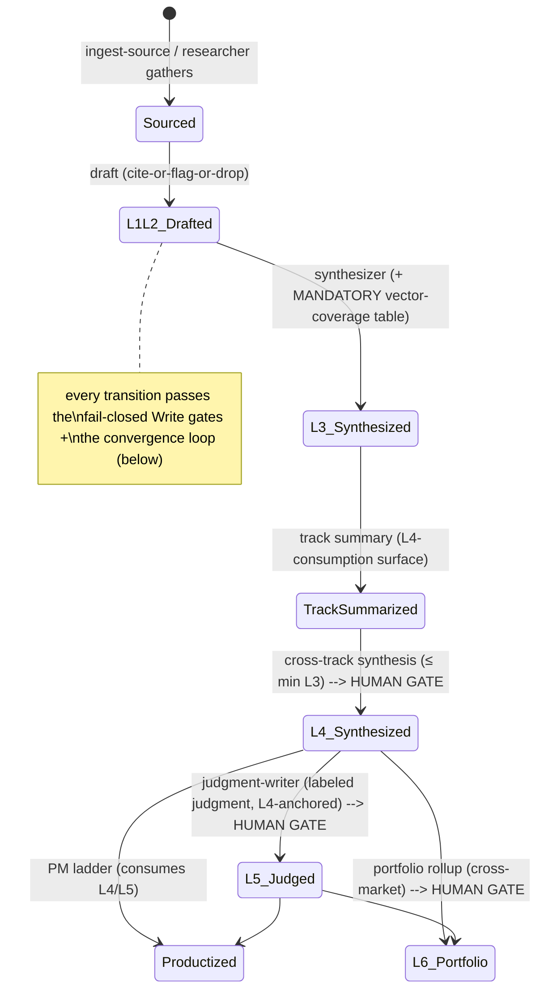
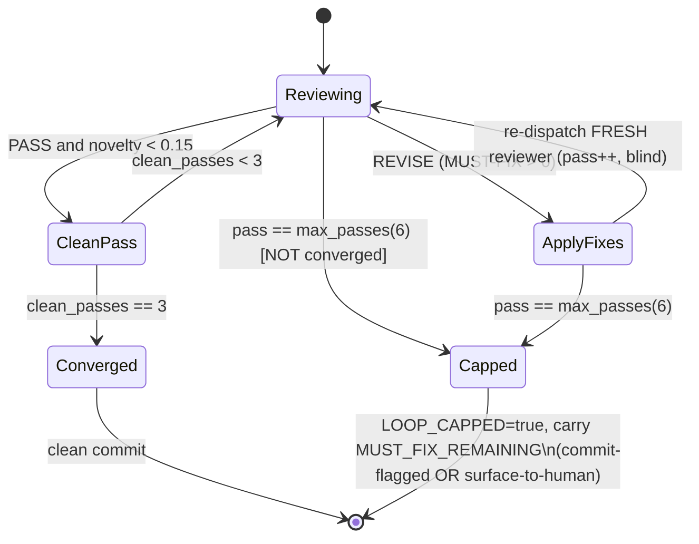
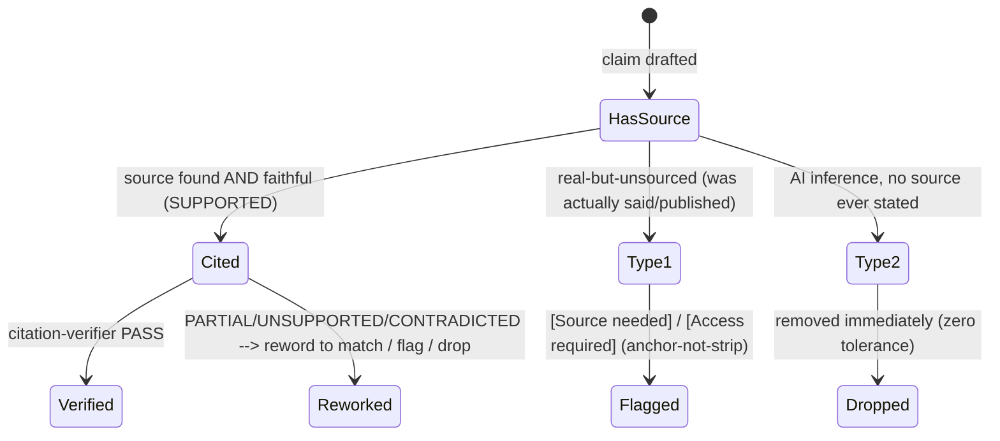

# Pass 2: Domain Model — research-factory engine

> Scope of record: `/Users/jmagady/Dev/research-factory/plugins/research-factory/` (the plugin = the engine).
> Builds on Pass 0 (inventory, 64 files / ~3,631 LOC) and Pass 1 (7 engine layers, 2 execution surfaces, convergence state machine). Honors their "remaining gaps" lists — this pass resolves Pass-0 gap #4 (config knob surface), Pass-0 gap #6 / Pass-1 gap #1 (L1–L6 corpus content model), Pass-1 gaps #2/#3/#4/#5/#7 (vector/track vocabulary, PM ladder, state aggregate, portfolio manifest).
> **The domain is a research-corpus production pipeline, not a business application.** Entities are documents, layers, claims, sources, and the production machinery — not orders, customers, or invoices. Every entity below is grounded in source read this pass (config template, LAYER-MODEL, FACTORY-SOUL, 6 corpus/PM templates, 6 agents, 2 skills, the require-citation hook, the ingest-source workflow, the research-protocol rule). No fabrication.
> Confidence tags: **HIGH** = explicit in source (template field, frontmatter, hook regex, agent Iron Law). **MEDIUM** = consistent across ≥2 sources but not named as a single entity. **LOW** = inferred from structure.

---

## 0. Orienting frame — what domain this is

The engine's domain is the **production of a layered, auditable research corpus from a seed**. The "product" is a stack of Markdown documents (`L1…L6`) in which **every claim traces to an external source that actually supports it**, and **no opinion appears below the explicit judgment layer (L5)**. The domain's unit economics are *tokens → sourced claims*; its quality oracle is not "does it compile" but **the Citation Test + adversarial-review convergence** (FACTORY-SOUL P1/P3/P7).

Two nested layer vocabularies must be kept distinct (Pass 1 §1 flagged this):
- **Engine layers (A–G)** — code/wiring structure (Pass 1's subject). *Not re-modeled here.*
- **Corpus content layers (L1–L6)** — the *domain* layers (this pass's subject): the observation stack the engine produces.

The bounded contexts (detailed in §2c) are: **Corpus Production** (L1→L4 observe-and-report), **Judgment** (L5, the first opinion layer, human-gated), **Portfolio** (L6, cross-market, separate repo), **PM Productization** (concept→acceptance, downstream of the corpus), and **Pipeline Control** (orchestration, convergence, state, autonomy/budget — the machinery, not corpus content).

---

# Sub-pass 2a — STRUCTURAL (entities · value objects · enums · relationships)

## 2a.1 Core entity catalog

One-shot example of the entry shape used below:

> ### Entity: `Source` (L1 raw external evidence)
> **Context:** Corpus Production. **Lifecycle:** ingested → drafted-into-L1 → cited-by-L2.
> **Key properties:** url/venue, author, date, sourcing-rule honored, access-state.
> **Invariants:** must be *external* and *primary-preferred*; a named external primary source is L1's only legal citation target.
> **Evidence:** `LAYER-MODEL.md:7` (L1 row), `researcher.md:54-56`. **Confidence:** HIGH.

---

### Entity: `Market` / `Instance`
**Context:** all (the aggregate root of one research domain). **Lifecycle:** `init-market` interview → config+seed written → first track proven by hand → cron autonomy enabled → registered in portfolio.
**Key properties (from `factory.config.template.yaml`):** `market` (human name), `slug` (kebab id used in paths/branches), `audience`, `phase` ∈ {observe-and-report | judgment | productization}.
**Invariants:** a Market differs from every other Market **only by config + seed, never code** (P10); the engine carries zero market-specific logic. A Market owns exactly one `factory.config.yaml`, one `seed/`, one corpus, N tracks, one vector schema.
**Evidence:** `factory.config.template.yaml:5-9`, `init-market/SKILL.md:9-13`, `FACTORY-SOUL.md:16`. **Confidence:** HIGH.

### Entity: `factory.config.yaml` (the per-market knob surface — Pass-0 gap #4, fully enumerated in §2a.6)
**Context:** Pipeline Control. The single configuration-of-record that parameterizes *all* engine behavior for a Market. Validated by `bin/factory-config.sh validate`.
**Invariants:** if a behavior cannot be expressed here (or in `seed/`), the engine must **stop and surface the gap** rather than special-case it (P10).
**Evidence:** `factory.config.template.yaml` (whole file), `init-market/SKILL.md:13`. **Confidence:** HIGH.

### Entity: `Seed`
**Context:** Corpus Production (the validation harness origin — P1). **Lifecycle:** authored once at `init-market` from interview, then the perpetual scoping reference.
**Key properties:** `scope_doc` (`seed/scope.md` — what "done" looks like, *required*), `source_inventory` (`seed/sources.md` — where evidence comes from, *required*), `existing_corpus` (path if migrating), plus `canonical_values` (`seed/canonical-values.md` — the source-of-truth set), and (per ingest) `seed/inbox/` (new-source dropzone).
**Invariants:** the seed defines the **validation harness**; sourcing effort exists to validate that a claim is Type-1, anchored to the seed scope.
**Evidence:** `factory.config.template.yaml:11-16`, `editorial.canonical_values:32`, `ingest-source.lobster:5`, `FACTORY-SOUL.md:7`. **Confidence:** HIGH.

### Entity: `Corpus`
**Context:** Corpus Production. The layered Markdown document stack under `corpus/<track-slug>/`, on `main` (the canonical branch).
**Key properties:** composed of L1–L4 docs (+ L5 within-market judgment); each doc carries layer frontmatter.
**Invariants:** stays **opinion-free through L4** (P5); every claim cited-or-flagged (P3/P4); layer-disciplined (each L_n cites only L_(n-1)).
**Evidence:** `LAYER-MODEL.md`, `research-protocol.md:8`, `FACTORY-SOUL.md:11`. **Confidence:** HIGH.

### Entity: `Track`
**Context:** Corpus Production (the research domain partition within a Market). **Lifecycle:** declared in config → scaffolded from `templates/corpus/` → built to adversary PASS via `build-track`.
**Key properties:** `slug` (*required*), `name` (*required*), `sourcing` ∈ {external-only | primary-source | public-record | local-mirror}.
**Invariants:** a Track's per-track sourcing rule must be honored exactly by the researcher; a track produces L1/L2 (per source) → L3 findings (with mandatory vector-coverage table) → a track-summary (the L4-consumption surface).
**Evidence:** `factory.config.template.yaml:23-26`, `init-market/SKILL.md:38`, `researcher.md:54`, `build-track/SKILL.md:34-35`. **Confidence:** HIGH.

### Entity: `Source`
(See one-shot example above.) The external primary evidence (URL / doc / person+venue+date). L1's only legal citation target. Carries an **access-state** that can become `[Access required: …]` if paywalled (anchor-not-strip, never dropped). **Confidence:** HIGH.

### Entity: `Claim`
**Context:** Corpus Production (the atomic truth-unit). **Lifecycle:** drafted → (carries citation | carries flag) → faithfulness-verified → adversary-reviewed.
**Key properties:** the proposition text, an attached **source marker** or **unsourced flag**, a **claim type** (Type-1 vs Type-2, see §2a.4), a faithfulness **verdict** (§2a.4).
**Invariants (the Iron Law):** **no claim ships without either a citation or an explicit `[Source needed: …]` flag** (`researcher.md:29`). A *present* citation is not enough — it must be **source-faithful** (the cited source actually supports the claim; P3). Type-2 (AI-invented) claims are **dropped immediately**, zero tolerance.
**Evidence:** `researcher.md:29,34-37`, `citation-verifier.md:30-39`, `FACTORY-SOUL.md:9-10,19-23`, `require-citation.sh:92-103`. **Confidence:** HIGH.

### The Layer documents (the observation stack) — L1 → L6

A single conceptual entity family `LayerDocument`, specialized by `layer` level. Each is a Markdown file with layer frontmatter (`date`, `layer`, `layer-observes`, `tags`). Per-layer specializations:

| Entity | layer / layer-observes | Scope | What it is | Citation target (the ONLY legal one) | Pure observation? | Evidence |
|---|---|---|---|---|---|---|
| `L1RawSourcing` | L1 / external (or empty/L0) | instance | One observation per external artifact | a named external primary source | yes | `LAYER-MODEL.md:7`, `researcher.md` |
| `L2Baseline` (Artifact observation) | L2 / L1 | instance | One observation per L1 artifact/section; has a `-tldr` variant (≤3pp) | a specific L1 artifact/section | yes | `LAYER-MODEL.md:8`, `templates/corpus/L2-baseline.md` |
| `L3Findings` (Track synthesis) | L3 / L2 | instance | Synthesizes this track's L2 docs; **carries the mandatory Vector-Coverage table**; has a `-tldr` variant | named L2 docs *in this track* | yes | `LAYER-MODEL.md:9`, `L3-findings.md:1-28`, `synthesizer.md:30-35` |
| `TrackSummary` | (L3-level, L4-consumption surface) | instance | The index/summary L4 reads instead of full L3 (token+drift discipline) | this track's L3 | yes | `synthesizer.md:39`, `L3-findings.md:63`, `templates/corpus/track-summary.md` |
| `L4CrossTrackSynthesis` | L4 / L3 | instance | Synthesizes *across* a Market's tracks; carries market-level vector picture + structural gaps; ends at a **human approval gate** | named L3 findings / track summaries | yes | `LAYER-MODEL.md:10`, `L4-cross-track-synthesis.md:1-54`, `synthesizer.md:37-42` |
| `L5Judgment` | L5 / L4 | instance | **The first opinion-bearing layer** within a Market; each judgment labeled-as-judgment and anchored to a named L4 | named L4 observations, *labeled as judgment* | **no** (opinion) | `LAYER-MODEL.md:11`, `judgment-writer.md:26-34` |
| `L6PortfolioSynthesis` | L6 / L4–L5 (across markets) | **portfolio repo** | The ONLY cross-market layer; cross-market judgment in a labeled section; market×vector roll-up | each market's named L4/L5 | **no** (cross-market judgment) | `LAYER-MODEL.md:12`, `L6-portfolio-synthesis.md:1-18`, `synthesizer.md:44-50` |

**Confidence:** HIGH for all rows (each is an explicit template + LAYER-MODEL row + agent section).

### Entity: `VectorCoverageTable` (value-bearing structure, mandatory at L3)
**Context:** Corpus Production. A table embedded in every L3Findings doc: one row per market evidence vector, each rated `Coverage ∈ {Strong, Moderate, Weak, None}` with an **Evidence basis** and a **Structural note** (which, for None/Weak, must say *why*).
**Invariants:** **a missing table is a MUST-FIX; an uncovered vector with no explanation is a SHOULD-FIX** (`LAYER-MODEL.md:35`). Rolls up to a market-level picture at L4 and a market×vector matrix at L6.
**Evidence:** `L3-findings.md:16-28`, `synthesizer.md:32-33`, `adversary-reviewer.md:32`. **Confidence:** HIGH.

### Entity: `EvidenceVector`
**Context:** Corpus Production (the per-market generalization — Pass-1 gap #3). **Lifecycle:** defined in config at `init-market`; immutable for the Market's lens.
**Key properties:** `id` (V1, V2, …, *required*), `name` (*required*), `desc`. Template default set: V1 Vendor/competitor, V2 Operator/user, V3 Influencer/practitioner. LAYER-MODEL notes a 7-vector example ("OT": Vendor, Operator, Influencer, Hearings, Governance, Incident, Capital).
**Invariants:** the engine enforces only that *some* vector schema exists and that the L3 coverage table is present — **it never hardwires the vector set** (P10). Vectors are per-instance config; the L6 market×vector roll-up takes the *union* of the markets' schemas.
**Evidence:** `factory.config.template.yaml:17-21`, `LAYER-MODEL.md:38`, `L6-portfolio-synthesis.md:46-50`. **Confidence:** HIGH.

### Entity: `Portfolio` + `PortfolioManifest`
**Context:** Portfolio. **Lifecycle:** the portfolio repo's "seed"; `init-market` step 7 appends a Market entry; the rollup Action reads it.
**Key properties (`portfolio/manifest.yaml`):** `window` (rollup window/release), `instances[]` with `slug` (→ `instance-outputs/<slug>/`), `repo` (owner/name of the private instance repo), `l4` globs, `l5` globs.
**Invariants:** the rollup pulls each instance's **named L4/L5 only** (latest window, index/summary level) — **never L3/L2/L1**; reaching across the market boundary into a lower layer is a layer-discipline violation and "blows the token budget." Adding a Market to the portfolio = appending an entry, **never new code** (P10).
**Evidence:** `portfolio/manifest.yaml:1-29`, `synthesizer.md:46`, `init-market/SKILL.md:45-49`. **Confidence:** HIGH.

### Entity: `PMDocLadder` (the productization document family — Pass-1 gap #4)
**Context:** PM Productization (downstream of the corpus; consumes L4/L5, adds no corpus claims). **Lifecycle:** a human selects a named L4/L5 finding → 5 sequential human-gated docs.
**Sub-entities (ordered, each a `templates/pm/` template):**
1. `ConceptNarrative`
2. `SixPager`
3. `PRD` — **the default unit of delivery**, 7 sections (Problem/Why · Context&Objectives · Target Users&UseCases · **Core Functionality = What it Eats / What it Does / What it Outputs** · Architecture&Dependencies · Delivery Phases&Scope · Risks/Metrics&Success); MVF separated from Future throughout; background→Appendix A.
4. `UserStories` (JTBD) — **7 required fields**: ID · persona · story(When/I want/So that) · inputs · outputs · acceptance criteria · PRD reference.
5. `AcceptancePlan`
**Invariants:** **never invent specifics** — missing info becomes a labeled **Assumption + Open Question**, never a fabricated requirement (`pm-doc-writer.md:30-32`). Keep **Evidence** (corpus observed) separate from **Assumptions** (inferred). Traceability IDs: `INIT · PRD · JTBD · US · AC`. Each step is a human gate.
**Evidence:** `pm-doc-writer.md:16,42-66`, `templates/pm/prd.md:1-49`, `factory.config.template.yaml:78-79`. **Confidence:** HIGH.

### Entity: `STATE` (`.factory/STATE.md` — the resume aggregate — Pass-1 gap #5)
**Context:** Pipeline Control. **Lifecycle:** created on first run, appended each burst, size-capped (history extracted to cycle files).
**Key properties:** current `phase`, current step, `decisions log`, `active branches`, `drift items`, `## Track build log` (one entry per burst).
**Invariants:** the **single zero-context-resume file** (P8 — "external filesystem is memory"). **Lives only on the orphan `factory-artifacts` branch**, gitignored on `main`, mounted as a worktree — *not in the code tree*. The state-manager only **writes the workspace file**; in CI the workflow owns the branch round-trip (restore-before / persist-after).
**Evidence:** `state-manager.md:31-45`, `research-protocol.md:18,40`, `FACTORY-SOUL.md:14`. **Confidence:** HIGH (structure named in state-manager; live file external to this tree).

---

## 2a.4 Value objects & enums (the domain vocabulary)

| Value object / enum | Domain | Members / form | Meaning | Evidence | Conf |
|---|---|---|---|---|---|
| **Layer level** | corpus | L1 · L2 · L3 · L4 · L5 · L6 | the observation stack; each cites only L_(n-1) | `LAYER-MODEL.md:5-12` | HIGH |
| **`layer-observes`** | corpus | external/L0 (L1) · L_(n-1) · "L4/L5 (across markets)" (L6) | frontmatter declaring the legal citation target; the layer-discipline guard reads it | `LAYER-MODEL.md:23-34`, `L6-portfolio-synthesis.md:4` | HIGH |
| **Claim type** | corpus | **Type-1** (real-but-unsourced — exhaust sourcing ladder, then *flag*, never drop) · **Type-2** (AI-invented inference, no source ever stated — **drop immediately**, zero tolerance) | the cite-or-flag-or-drop trichotomy's two unsourced cases | `FACTORY-SOUL.md:19-23`, `researcher.md:34-37` | HIGH |
| **Source marker (citation)** | corpus | `https?://` · markdown URL link · `[^footnote]` · `[[wikilink]]` (downward internal cite) · `<doc>.md` ref · frontmatter `cites:/source:/sources:` | what the require-citation hook accepts as a citation | `require-citation.sh:92-101` | HIGH |
| **Unsourced flag** | corpus | `[Source needed: <what searched, why unfound>]` (Type-1) · `[Access required: <source> — <barrier> — <cost>]` (paywall) · `[unsourced]` · `[citation needed]` | the anchor-not-strip markers (Type-1 stays, flagged) | `research-protocol.md:28`, `require-citation.sh:97`, `researcher.md:35` | HIGH |
| **Vector coverage rating** | corpus | Strong · Moderate · Weak · None | per-vector evidence depth in the L3 table | `LAYER-MODEL.md:35`, `L3-findings.md:23-28` | HIGH |
| **Citation-faithfulness verdict** | review | SUPPORTED · PARTIAL · UNSUPPORTED · CONTRADICTED · UNREACHABLE | NLI-style per-claim source-support classification; UNSUPPORTED/CONTRADICTED = MUST-FIX | `citation-verifier.md:33,39` | HIGH |
| **Adversary verdict** | review | **PASS** (zero MUST-FIX) · **REVISE** | the loop's per-pass outcome | `adversary-reviewer.md:38` | HIGH |
| **Finding severity** | review | MUST-FIX (blocks promotion) · SHOULD-FIX · SUGGESTION | adversary finding classification | `adversary-reviewer.md:37` | HIGH |
| **Quality tier** | review | Production (0 markers + L3 + adversary PASS) · Beta · Alpha (SHOULD-FIX remain) · Revise (MUST-FIX remain) | review-assigned, *never self-reported* | `research-protocol.md:41` | HIGH |
| **Per-track sourcing rule** | config | external-only · primary-source · public-record · local-mirror | how a track may gather evidence | `factory.config.template.yaml:25-26`, `init-market/SKILL.md:38` | HIGH |
| **Phase** | config | observe-and-report · judgment · productization | which contexts the Market has graduated into | `factory.config.template.yaml:9` | HIGH |
| **Autonomy level** | config | 3 (human gate on every merge) · 3.5 (auto-merge low-risk research PRs) · 4 (full auto for research layer; L5/L6/PM/publish still human) | how much the night-shift may do unattended | `factory.config.template.yaml:48-52`, `docs/AUTONOMY.md` | HIGH |
| **Convergence params** | config | `novelty_threshold: 0.15` · `clean_passes_required: 3` · `max_passes: 6` (hard cap, ≥ clean_passes) | the quantitative convergence contract | `factory.config.template.yaml:38-47` | HIGH |
| **`on_cap` dispatch** | control | commit-flagged (build-track/ingest) · surface-to-human (judgment/cross-track/portfolio) | what a capped exit does | Pass-1 §3.3, `ingest-source.lobster:50` | HIGH |
| **Model-family tier** | config/review | builder=implementation (sonnet) · reviewer=adversary (**MUST be a different family**) | the builder≠reviewer wall (P6); realized structurally at the CI layer (Claude builds · Codex/Gemini review) | `factory.config.template.yaml:36-37`, `adversary-reviewer.md:3,14` | HIGH |
| **Hook verdict** | gate | allow · deny | PreToolUse:Write envelope decision (fail-closed) | `require-citation.sh:33-48` | HIGH |
| **Budget threshold tier** | config | warn(100) · alert(250) · pause(400) · hard_stop(500) + `per_run_cap`(25) | cumulative-spend governance | `factory.config.template.yaml:65-74` | HIGH |
| **`always_human` action** | config | l5_judgment · l6_portfolio · pm_productization · publish_or_external_delivery | never auto at any autonomy level | `factory.config.template.yaml:58-62` | HIGH |

---

## 2a.5 Relationships (the domain graph)

**The layer spine (one-directional citation — the engine's defining relationship):**
```
external Source ──cited-by──▶ L1 ──observed-by──▶ L2 ──synthesized-by──▶ L3 (+VectorCoverageTable)
   ──summarized-by──▶ TrackSummary ──cross-synthesized-by──▶ L4 ──judged-by──▶ L5
                                                                        │
   (across markets, portfolio repo)  L4/L5 of each Market ──rolled-up-by──▶ L6
```
Rule: an `L_n` doc **cites only `L_(n-1)`**. Reaching further down (e.g. L4 citing a raw L1 URL) is a layer-discipline violation. **Confidence:** HIGH (`LAYER-MODEL.md:3,34`).

**Containment / ownership:**
- `Market` 1──N `Track`; `Market` 1──1 `factory.config.yaml`; `Market` 1──1 `Seed`; `Market` 1──1 `Corpus`; `Market` 1──1 `EvidenceVector schema (1..N vectors)`.
- `Track` 1──N `L1/L2 docs`; `Track` 1──1 `L3Findings` 1──1 `VectorCoverageTable`; `Track` 1──1 `TrackSummary`.
- `Corpus` 1──N `L4CrossTrackSynthesis`; `Market` 0..N `L5Judgment`.
- `Portfolio` 1──N `Market` (via `PortfolioManifest.instances[]`); `Portfolio` 1──N `L6PortfolioSynthesis`.
- `Source` 1──N `Claim`; `Claim` N──1 `LayerDocument` (a claim lives in a doc).
- `L4/L5 finding` 1──N `PMDocLadder` (a selected finding is productized; PM consumes, never writes back).

**Cross-cutting (Pipeline Control owns these, not the corpus):**
- `STATE` records the resume state of all of the above (phase, branches, build log).
- `factory.config.yaml` parameterizes every relationship's behavior (vectors → L3 table rows; tracks → corpus partition; convergence → review loop; autonomy/merge → gate behavior; budget → dispatch governance).

**Confidence:** HIGH for spine/containment (explicit in templates + LAYER-MODEL); MEDIUM for the PM-consumes-finding edge (stated in pm-doc-writer, no schema link).

---

## 2a.6 `factory.config.yaml` knob surface — full enumeration (resolves Pass-0 gap #4)

Every key, and the engine behavior it parameterizes. This is the empirical test of "config + seed, never code" (P10): if a behavior is here, it is data; if it is not, the engine must surface a gap rather than special-case.

| Config key | Type / default | Behavior parameterized | Evidence |
|---|---|---|---|
| `market` | string (req) | human display name across docs | `:6` |
| `slug` | kebab (req) | paths, branch names (`claude/<track>-*`), `instance-outputs/<slug>/` | `:7` |
| `audience` | string | corpus consumer framing | `:8` |
| `phase` | enum (observe/judgment/productization) | which contexts the Market has graduated into | `:9` |
| `seed.scope_doc` | path (req) | the "what done looks like" validation anchor | `:13` |
| `seed.source_inventory` | path (req) | where evidence comes from (sourcing ladder seed) | `:14` |
| `seed.existing_corpus` | path | migration entry point | `:15` |
| `vectors[]` | list {id,name,desc} (id+name req) | **the per-market evidence lens** → L3 vector-coverage table rows, L4 market picture, L6 market×vector roll-up | `:18-21` |
| `tracks[]` | list {slug,name,sourcing} (slug+name req) | **the research-domain partition** → `corpus/<track>/`, build-track targets, per-track sourcing rule | `:24-26` |
| `editorial.forbidden_phrases_extra` | list | market-specific additions to the forbidden-phrase guard (generic patterns stay in the hook; market names go here — P10) | `:30` |
| `editorial.per_track_sourcing_default` | enum | default sourcing rule when a track omits it | `:31` |
| `editorial.canonical_values` | path | the single-source-of-truth set (counts/dates) | `:32` |
| `review.builder_model_tier` | implementation (sonnet) | the drafter family | `:36` |
| `review.reviewer_model_tier` | adversary (**diff. family**) | the adversary family — the P6 wall | `:37` |
| `review.convergence.novelty_threshold` | 0.15 | loop converges when novelty stays below this | `:39` |
| `review.convergence.clean_passes_required` | 3 | consecutive clean passes to converge | `:40` |
| `review.convergence.max_passes` | 6 (hard cap, ≥clean) | the runaway cap → capped-exit | `:41-47` |
| `autonomy_level` | 3 / 3.5 / 4 | how much the night-shift merges/runs unattended | `:48-52` |
| `merge.auto_merge_when[]` | adversary PASS · must_fix=0 · drift none | the auto-merge predicate (only at ≥3.5) | `:54-57` |
| `merge.always_human[]` | l5/l6/pm/publish | never auto, any autonomy level | `:58-62` |
| `budget.currency` | usd | spend unit | `:66` |
| `budget.per_run_cap` | 25 | pause a single run beyond this | `:67` |
| `budget.thresholds` | warn100/alert250/pause400/hard_stop500 | cumulative-spend governance tiers | `:68-72` |
| `budget.vendors[]` | anthropic/openai/google | each = a separate GitHub Secret | `:73` |
| `budget.on_critical_path_downgrade` | pause | if budget forces a model downgrade, PAUSE not continue underpowered | `:74` |
| `deliverables.research[]` | l3-findings/tldr/track-summary/l4 | which research docs this Market produces | `:78` |
| `deliverables.pm[]` | concept/six-pager/prd/stories/acceptance | which PM-ladder docs this Market produces | `:79` |

**P10 verdict:** every variability axis surfaced in this pass (vector schema, track set + sourcing, editorial additions, model families, convergence numbers, autonomy/merge policy, budget governance, deliverable set) **is expressible as config**. The only market-specific text *not* in config — generic forbidden-phrase patterns — is deliberately generic in the hook, with market names deferred to `forbidden_phrases_extra`. **The "config + seed, never code" invariant holds.** **Confidence:** HIGH.

---

# Sub-pass 2b — BEHAVIORAL (operations · business rules · state machines · events)

## 2b.1 Domain operations (by context)

One-shot example of the operation shape:

> **Op: `draft-L1/L2` (researcher).** *Pre:* a Source + the track's sourcing rule loaded. *Post:* an L1/L2 doc where every claim carries a citation or a `[Source needed:…]`/`[Access required:…]` flag; zero Type-2 content; frontmatter `layer`/`layer-observes` set. *Rule:* observe-and-report only; exhaust the sourcing ladder before flagging. *Evidence:* `researcher.md:53-58`. *Conf:* HIGH.

| Operation | Actor | Pre | Post | Governing rule | Evidence | Conf |
|---|---|---|---|---|---|---|
| `ingest-source` | researcher (+capture/quarantine-fetch skills) | a new source in `seed/inbox/` | L1/L2 observation drafted, cited; paywall→`[Access required]` (not drop) | cite-or-flag-or-drop; on_failure=flag-access-required | `ingest-source.lobster:7-19` | HIGH |
| `draft-L1/L2` | researcher | (see one-shot) | sourced L1/L2 docs | observe-only; anchor-not-strip | `researcher.md` | HIGH |
| `synthesize-L3` | synthesizer | a track's L2 docs | L3 findings + **mandatory** vector-coverage table; every finding cites a named L2 | missing table = MUST-FIX | `synthesizer.md:30-35` | HIGH |
| `synthesize-L4` | synthesizer | track summaries (index only, never full L3) | L4 cross-track synthesis citing named L3 | quality ≤ min(L3); ends at human gate | `synthesizer.md:37-42` | HIGH |
| `write-L5` | judgment-writer | named L4 observations | L5 judgments, each labeled-as-judgment + L4-anchored | no new empirical claim; always human-gated | `judgment-writer.md:29-40` | HIGH |
| `synthesize-L6` | synthesizer | each Market's named L4/L5 (in portfolio repo) | cross-market synthesis + labeled judgment + market×vector roll-up | never reach into a market's L3/L2/L1; always human-gated; ≤ min(L4/L5) | `synthesizer.md:44-50` | HIGH |
| `verify-faithfulness` | citation-verifier | a claim + its cited source (claim+source only, blind) | per-claim verdict (SUPPORTED…CONTRADICTED/UNREACHABLE); UNSUPPORTED/CONTRADICTED=MUST-FIX | never upgrade a verdict to rescue a claim | `citation-verifier.md:28-39` | HIGH |
| `adversary-review` | adversary-reviewer (CI: diff. family) | the artifact-as-written (blind to prior passes/reasoning) | findings list + verdict PASS/REVISE + novelty count | 6 dimensions; blindness is structural | `adversary-reviewer.md:23-38` | HIGH |
| `editorial-sweep` | editorial-sweeper | a corpus doc | nuanced observe-only findings (superlatives, mandate-path, attributed judgment) | recall side of P5 the hook can't do | Pass-1 §5 | HIGH |
| `productize` | pm-doc-writer | a human-selected named L4/L5 finding | the PM ladder doc set | never invent specifics → Assumption+Open Question | `pm-doc-writer.md:30-66` | HIGH |
| `commit-burst` | state-manager (sole committer, last) | review verdicts recorded; adversary not REVISE | one atomic commit (corpus + `.factory/STATE.md` update) | one burst → one commit, authored only by me | `state-manager.md:27-47` | HIGH |
| `init-market` | init-market skill (human-gated) | interview answers | config + seed + Action templates + STATE + portfolio entry | zero market-specific engine code | `init-market/SKILL.md:31-50` | HIGH |

## 2b.2 Core business rules (invariants the engine enforces)

1. **Cite-or-flag-or-drop (P3/P4).** Every claim → a source marker, OR a Type-1 flag, OR (if Type-2) dropped. Enforced *three ways*: the researcher's self-check, the `require-citation.sh` fail-closed hook (substantive corpus doc with neither citation nor flag → **deny**), and the citation-verifier's faithfulness pass. **HIGH.**
2. **Source-faithfulness, not mere presence (P3).** A present URL that does not *support* the claim is UNSUPPORTED/CONTRADICTED = MUST-FIX. Faithfulness is checked NLI-style by a *blind* verifier. **HIGH.**
3. **Anchor-not-strip (P4).** Type-1 (real-but-unsourced) claims are flagged and reframed, **never silently deleted**; only Type-2 inventions are removed. Documented failed sourcing is corpus data. **HIGH.**
4. **Layer discipline.** Each L_n cites only L_(n-1); the layer-discipline guard reads `layer`/`layer-observes` and denies a violation. The L3 vector-coverage table is mandatory. **HIGH.**
5. **Observe-and-report through L4; judgment only at L5; productization only in the PM pipeline (P5).** The corpus is opinion-free below L5. Enforced by the forbidden-phrase guard (bright lines) + editorial-sweeper (nuance) + adversary dimension #3. L6 is the cross-market judgment exception (labeled + human-gated). **HIGH.**
6. **Quality propagates downward-capped.** **L4 ≤ min(L3) ≤ min(L2)**; L6 ≤ min(contributing L4/L5). A weak lower layer caps everything above it. **HIGH** (`LAYER-MODEL.md:36`, `synthesizer.md:41,49`).
7. **Quantitative convergence, not "looks done" (P7).** The adversary loop runs until novelty < 0.15 for 3 consecutive clean passes — capped at max_passes=6. A cap is a loud, honest fallback, **not** a license to bail early (Iron Law: "you still loop to the cap"). **HIGH.**
8. **Builder ≠ reviewer, different family (P6).** Reviewers never see the drafter's reasoning or prior passes (info-asymmetry walls, structural). Realized at the CI layer (Claude builds · Codex/Gemini review). **HIGH.**
9. **Sole-committer, runs last (P8).** Only the state-manager commits; one burst → one atomic commit; refuses to commit if verdicts aren't recorded or the adversary said REVISE. **HIGH.**
10. **Human gates on the irreversible/judgment.** L5, L6, PM productization, publish/external delivery are `always_human` at any autonomy level; the night-shift never merges at autonomy 3. **HIGH.**
11. **Single-Source-of-Truth.** Each canonical metric (track/vendor counts, dates) lives in exactly one file; nothing re-derives a canonical value. **HIGH** (`research-protocol.md:9`, `state-manager.md:46`).
12. **Generic engine, per-market config (P10).** No market logic in the engine; unexpressible variability → stop and surface the gap. **HIGH.**

## 2b.3 State machines

### A. Layer-production lifecycle (how a Track advances L1→L4, then L5/L6)

Each layer transition is itself wrapped by the **review→converge→commit** burst (§2b.3.B). L1–L4 are pure observation; L5/L6 add labeled judgment behind a required human approval. **Confidence:** HIGH.

### B. The convergence loop (the heart — restated from Pass-1 §3.2 as a domain state machine)

Novelty = new / (new + dup) findings per pass. Freshness invariant: each pass re-dispatches a reviewer blind to prior passes. **Confidence:** HIGH.

### C. Market phase progression
`observe-and-report` → (judgment enabled) `judgment` → (PM enabled) `productization`. Gated by proving tracks by hand and human approval; autonomy starts at 3. **Confidence:** MEDIUM (phase enum explicit; transition triggers inferred from init-market "prove one track first").

### D. Claim disposition (the cite-or-flag-or-drop trichotomy as a decision machine)

**Confidence:** HIGH.

## 2b.4 Domain events / transitions

| Event | Trigger | Consequence | Evidence | Conf |
|---|---|---|---|---|
| `SourceIngested` | new file in `seed/inbox/` (or cron) | capture → quarantine-fetch → draft L1/L2 | `ingest-source.lobster:1-19` | HIGH |
| `ClaimFlagged` | Type-1 claim can't be sourced after the ladder | `[Source needed]`/`[Access required]` written, claim retained | `researcher.md:35`, `research-protocol.md:28-33` | HIGH |
| `ClaimDropped` | Type-2 inference detected | removed immediately, zero corpus Type-2 | `FACTORY-SOUL.md:21-23` | HIGH |
| `FaithfulnessVerdict` | citation-verifier per claim | SUPPORTED…CONTRADICTED/UNREACHABLE; MUST-FIX on UNSUPPORTED/CONTRADICTED | `citation-verifier.md:33` | HIGH |
| `AdversaryPASS` / `AdversaryREVISE` | adversary pass completes | REVISE → apply MUST-FIX + re-loop; PASS → toward gate | `adversary-reviewer.md:38` | HIGH |
| `ConvergenceReached` | novelty<0.15 × 3 clean passes | gate passes; clean commit | `build-track/SKILL.md:37-39` | HIGH |
| `ConvergenceCapped` | pass == max_passes (6), not converged | LOOP_CAPPED=true; commit-flagged OR surface-to-human | `factory.config.template.yaml:41-47`, Pass-1 §3.3 | HIGH |
| `HumanGateApproved` | human approves an L5/L6/PM/publish step | the human-approval step clears; flow proceeds | `judgment-writer.md:39`, `merge.always_human` | HIGH |
| `StateCommitted` | state-manager runs last | one atomic commit (corpus + STATE); `factory-artifacts` updated | `state-manager.md:38-47` | HIGH |
| `MarketRegistered` | init-market step 7 | Market appended to portfolio manifest; future rollups include it | `init-market/SKILL.md:45-49` | HIGH |
| `BudgetThresholdCrossed` | cumulative spend ≥ warn/alert/pause/hard_stop | pause new work / refuse dispatch / pause-on-downgrade | `factory.config.template.yaml:65-74` | MEDIUM (config declares; enforcement agent not located this pass) |

---

## 2b.5 Ubiquitous-language glossary (domain terms)

- **Layer (L1–L6)** — a level in the observation stack; cites only one level down.
- **Vector** — a per-market evidence lens (Vendor/Operator/Influencer/…); the L3 coverage table rates each.
- **Track** — a research-domain partition within a Market, with its own sourcing rule.
- **Cite-or-flag-or-drop** — the claim trichotomy: cite it, flag it (Type-1), or drop it (Type-2).
- **Anchor-not-strip** — flag a real-but-unsourced claim rather than delete it.
- **Source-faithful** — the cited source *actually supports* the claim (NLI-style), not merely present.
- **Convergence** — review loops until finding-novelty decays below threshold for N clean passes (capped).
- **Capped exit** — loop hit max_passes without converging: commit/surface *flagged*, never disguised as PASS.
- **Info-asymmetry wall** — reviewers blind to prior passes / drafter reasoning (P6).
- **Burst** — one production cycle ending in exactly one atomic commit by the state-manager.
- **Observe-and-report** — the L1–L4 stance: describe what sources say; no judgment/ranking/"what to build."
- **MVF** — the PM ladder's "Minimum Viable Feature" scope, separated from Future throughout.

---

## Resume checkpoint

```yaml
pass: 2
status: complete
files_read_this_pass: 18   # config template, LAYER-MODEL, FACTORY-SOUL, 4 corpus templates, portfolio manifest, 6 agents, 2 skills, prd template, research-protocol rule, require-citation hook, ingest-source workflow (re-read pass-0/1 outputs)
entities_catalogued: 16    # Market, factory.config, Seed, Corpus, Track, Source, Claim, L1..L6 LayerDocument family, VectorCoverageTable, EvidenceVector, Portfolio+Manifest, PMDocLadder, STATE
value_objects_enums: 19
business_rules: 12
state_machines: 4          # layer-production, convergence, market-phase, claim-disposition
config_keys_enumerated: 26 # resolves pass-0 gap #4
gaps_resolved: [pass0-gap-4 config-knob-surface, pass0-gap-6 L1-L6-content-model, pass1-gap-3 vector-track-vocab, pass1-gap-4 PM-ladder, pass1-gap-5 STATE-aggregate, pass1-gap-7 portfolio-manifest]
timestamp: 2026-06-01T00:00:00Z
next_pass: 3
next_pass_name: Behavioral Contracts
```

## Remaining gaps / next candidate scope (for Pass 3+ and Pass-2 deepening)

1. **Function-level claim-disposition contract (Pass 3, HIGH priority).** The cite-or-flag-or-drop trichotomy is enforced in *three* places (researcher self-check, `require-citation.sh` regex, citation-verifier). Pass 3 must extract the exact precondition/postcondition contract of `require-citation.sh` from `tests/hooks.bats` + `tests/hooks-v05.bats` (not read this pass) — the bats cases are the HIGH-confidence behavioral truth for the source-marker/flag accept-set and the MIN_CLAIM_LINES stub threshold.
2. **Vector-coverage table contract depth.** The Strong/Moderate/Weak/None value object + "missing table = MUST-FIX / unexplained None = SHOULD-FIX" rule should become a Pass-3 BC; verify against `L3-findings-tldr.md` + `track-summary.md` (not read this pass) for the exact roll-up fields.
3. **STATE.md field schema.** Modeled here from `state-manager.md` prose (phase/step/decisions/branches/drift/track-build-log); the *live* file is on `factory-artifacts` (external to this tree). A deepening round could read it via `git show origin/factory-artifacts:STATE.md` to confirm the actual aggregate shape.
4. **Budget enforcement actor.** `BudgetThresholdCrossed` is declared in config but the *enforcing* agent/hook was not located this pass (MEDIUM). Pass 3/4 should trace whether enforcement is in an Action template, the orchestrator, or unimplemented (a possible gap).
5. **L2-baseline / track-summary / L3-tldr / concept-narrative / six-pager / acceptance-plan templates** were not read in full this pass (read L3/L4/L6/PRD). A Pass-2 deepening round should read the remaining `templates/corpus/*` and `templates/pm/*` to confirm no additional value objects (e.g., the track-summary's L4-consumption field set).
6. **Phase-transition triggers (MEDIUM).** The `phase` enum is explicit; the *operations* that graduate a Market observe→judgment→productization are inferred from init-market's "prove one track first." Pass 3 should pin the transition contract.
7. **Maintenance/consistency domain.** The `consistency-validator` + `dashboard-builder` + maintenance workflow touch *drift detection* and *single-source-of-truth* validation across docs — a candidate small bounded context ("Corpus Health") not deeply modeled this pass.
```
