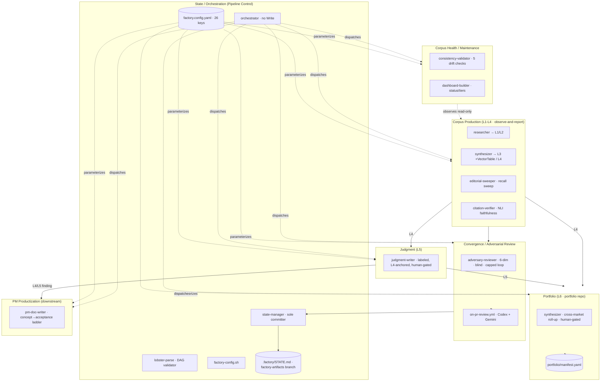

# Pass 8 — Definitive Deep Synthesis: research-factory engine

> **Dogfood framing.** This is a *dogfood swap*: the reference codebase we analyzed (the
> research-factory engine) **is** the target the vsdd-factory pipeline will now improve. The usual
> "what the target does vs. what the reference does" split therefore collapses. Section 8 (the backlog)
> frames every lesson as a **self-edit to the engine's own files** — concrete `plugins/research-factory/…`
> paths to change, read directly downstream by create-brief / create-prd.
>
> Built from all 12 prior artifacts (7 broad + 5 deep) + the B.5 coverage audit (PASS, 0 blind spots) +
> the B.6 extraction validation (PASS, 0 hallucinations, 4 minor cosmetic deltas). Section 7 reconciles
> the cosmetic deltas authoritatively by re-counting with the shell. This document supersedes Pass 6.

---

## 1. Definitive system understanding

### What the engine is

The **research-factory engine** is a **domain-agnostic, declarative research-corpus production pipeline**
shipped as a Claude Code plugin (`.claude-plugin/plugin.json` v0.9.0, MIT). Across **64 files / ~3,631 LOC**
(re-verified byte-for-byte in B.6, delta 0) it has *almost no runtime application code*: the only
general-purpose code is `bin/lobster-parse` (147 LOC Python — a DAG validator/orderer) and
`bin/factory-config.sh` (109 LOC Bash — a config validator). The "program" is a **contract distributed
across four declarative substrates**:

1. **Markdown-as-agent** prompt files — **11 subagents** (1 orchestrator + 10 workers) — the behavioral spec;
2. **`.lobster` YAML DAGs** — **7 workflows** — the pipeline-as-data;
3. **Bash PreToolUse:Write hooks** — **4 fail-closed gates** — the deterministic enforcement;
4. **`factory.config.yaml`** — the **26-key config-of-record** — the per-market policy layer.

### The unifying thesis: "enforces structurally, executes by reasoning"

The single thread through every pass: the engine **enforces structurally, executes by reasoning.**
Determinism guards the *boundaries* — hooks fail closed, `lobster-parse` refuses malformed/cyclic DAGs,
info-asymmetry is realized by `context.exclude` + read-only tool grants + the CI model-family split, and the
sole-committer is a DAG terminal. An **LLM orchestrator interprets the runtime *semantics*** — convergence
math, gate predicates, capped-exit honesty — that no checker validates. **Every confidence grade and every
gap in this analysis falls out of which side of that line a behavior sits on.** The deterministic surface is
31 test-backed contracts / 11 MECHANICAL NFRs; the reasoned surface (the entire agent/orchestration layer) is
0% test-backed (MEDIUM/LOW, enforced by structure + prose).

### The two execution surfaces

| Surface | Trigger | Execution | Gates | P6 cross-family wall |
|---|---|---|---|---|
| **(a) Local Claude plugin** | `/build-track`, `/init-market`, `/pm-doc-chain` | one Claude session; orchestrator dispatches sub-agents in one **model family** | all 4 PreToolUse:Write hooks fire | **simulated** (same family plays builder + adversary — acknowledged fallback) |
| **(b) GitHub Actions** | cron / PR / dispatch (5 `.yml` templates) | **multi-family CLIs** | hooks not native to CLIs; the permission/sandbox blocks substitute | **structural**: Claude *builds* (`claude-code-action`, sonnet) → Codex *adversary-reviews* (`codex-action`, gpt-5.5, read-only) → Gemini *citation-verifies* (`run-gemini-cli`). Three families touch one PR. |

### The L1→L6 layer spine (the domain)

The product is a layered, auditable Markdown stack where **each `L_n` cites only `L_(n-1)`**:

```
external Source ─cited-by▶ L1 ─observed-by▶ L2 ─synthesized-by▶ L3 (+VectorCoverageTable, mandatory)
  ─summarized-by▶ TrackSummary ─cross-synthesized-by▶ L4 ─judged-by▶ L5
  (across markets, portfolio repo)  each Market's L4/L5 ─rolled-up-by▶ L6
```

L1–L4 are **opinion-free observe-and-report**; **L5** is the first opinion-bearing layer (within-market
judgment, human-gated); **L6** is the *only* cross-market layer (portfolio repo, labeled judgment, human-gated).
Quality propagates **downward-capped**: `L4 ≤ min(L3) ≤ min(L2)`, `L6 ≤ min(contributing L4/L5)`.

### The constitution (P1–P10) — the non-negotiables

- **P1** Validate against a seed harness (the seed defines "done").
- **P3/P4** Cite-or-flag-or-drop, source-faithfully: every claim → citation, OR a Type-1 `[Source needed]`/`[Access required]` flag (anchor-not-strip), OR (Type-2 AI-invention) dropped immediately, zero tolerance. Presence ≠ faithfulness (NLI verdict).
- **P5** Observe-and-report through L4; judgment only at L5; productization only in the PM pipeline.
- **P6** Builder ≠ reviewer, different model family; info-asymmetry walls are structural (reviewers never see prior passes or drafter reasoning).
- **P7** Quantitative convergence — loop until finding-novelty `< 0.15` for 3 clean passes, **hard-capped** at `max_passes: 6`; a capped exit is a loud honest fallback, never a faked PASS.
- **P8** State-manager is the sole committer, runs last; one burst → one atomic commit; "external filesystem is memory."
- **P9** Effort-scale; document what you dropped.
- **P10** Generic engine, per-market config — a market = `factory.config.yaml` + `seed/`, never new code; unexpressible variability → stop and surface the gap.

### Engine layers (code structure, distinct from corpus L1–L6)

A registration → B entry/interface → C orchestration → D workflow-DAGs → E agents → **F cross-cutting
fail-closed gates** → G templates/scaffolding. Dependency is one-directional A→…→E; F intercepts every Write;
G is copied into instances and inert at engine runtime.

---

## 2. Complete feature set

Every capability the engine delivers, grouped by the bounded context that owns it.

### Corpus Production (L1→L4 observe-and-report)
- **Source ingestion** (`ingest-source.lobster`): capture → quarantine-fetch → draft L1/L2; paywall → `[Access required]` not drop.
- **L1/L2 drafting** (`researcher`): effort-scaled fan-out; MCP-first/deterministic-fallback search; per-track sourcing rule (external-only / primary-source / public-record / local-mirror); self-check before write.
- **L3 synthesis** (`synthesizer`): findings + **mandatory Vector-Coverage table** (Strong/Moderate/Weak/None per market evidence vector); reads only L2.
- **Track summary**: a complete `Fn` finding index + 3-col vector reduction + Structural Gaps + a "Bottom Line" an L4 synthesizer can lift directly. The L4-consumption surface (summary/index only — never full L3).
- **L4 cross-track synthesis** (`synthesizer`): market-level picture (optional vector roll-up with a `Contributing tracks` column) + structural gaps; ends at a human gate.
- **Editorial sweep** (`editorial-sweeper`): nuanced observe-only recall pass (6 drift categories) the bright-line hook can't catch.
- **Citation verification** (`citation-verifier`): blind NLI-style per-claim verdict SUPPORTED/PARTIAL/UNSUPPORTED/CONTRADICTED/UNREACHABLE; never upgrades to rescue a claim.

### Convergence / Adversarial Review
- **Adversarial review loop** (`adversary-reviewer`): 6-dimension review, fresh+blind reviewer each pass, novelty = new/(new+dup), PASS (0 MUST-FIX) / REVISE; loops until novelty < 0.15 × 3 clean passes, **capped at 6**.
- **Honest capped exit**: `on_cap: commit-flagged` (build-track/ingest → PR titled `[DID NOT CONVERGE: M MUST-FIX]`) or `surface-to-human` (judgment/cross-track/portfolio → carried into the approval prompt).
- **Two gate idioms**: boolean `pass_when` (build-track) and a 7-key `criteria:`-map of `clear` readiness flags (pm-doc-chain).
- **Cross-family CI review** (`on-pr-review.yml`): Codex adversary + Gemini citation-verify on every Claude-authored PR, diff-scoped, read-only, no-black-box (artifacts + PR comments).

### Corpus Health / Maintenance
- **Consistency validation** (`consistency-validator`): 5 typed drift checks (broken reference, canonical-value drift vs `seed/canonical-values.md`, layer-tag, traceability break, naming) → DriftItems with MUST-FIX/SHOULD-FIX/SUGGESTION severity.
- **Dashboard / status** (`dashboard-builder`): per-track L3+vector-table presence, unresolved-marker counts, **review-assigned** quality tier (never self-assigned), deltas since last build.
- **Maintenance workflow** (`maintenance.lobster`): weekly cron; consistency ∥ editorial → dashboard → state-manager PR (human merges).

### Judgment (L5) & Portfolio (L6)
- **L5 judgment** (`judgment-writer`, `judgment.lobster`): labeled-as-judgment, L4-anchored, no new empirical claim, always human-gated.
- **L6 portfolio synthesis** (`synthesizer`, `portfolio-synth.lobster`, `portfolio-rollup.yml`): cross-market roll-up; pulls each instance's named L4/L5 *only* (manifest-driven, glob-scoped, blobless clone); market×vector matrix with `n/a` cells; cross-market judgment in a single labeled section; always human-gated.

### PM Productization
- **PM ladder** (`pm-doc-writer`, `pm-doc-chain.lobster`): Concept → 6-Pager → 7-section PRD → JTBD user stories → Acceptance Plan, **one artifact at a time**, each behind a human gate; never invents specifics → labeled Assumption + Open Question; traceability IDs INIT/PRD/JTBD/US → TC/EC; Definition-of-Done terminal gate.

### State / Orchestration (Pipeline Control)
- **Workflow validation/ordering** (`lobster-parse`): schema + Kahn topo order; refuses invalid DAGs.
- **Config validation** (`factory-config.sh`): required-field validation; `vectors`/`tracks`/`get`/`editorial`/`path` readers.
- **Orchestration** (`orchestrator`): validate-then-order → dispatch in `depends_on` order → run convergence → honor `context.exclude` walls → honor gates; **holds no Write tool**.
- **Sole-committer + state** (`state-manager`): one atomic burst commit (corpus + `.factory/STATE.md`); CI/local round-trip split.
- **Market standup** (`init-market`): interview → write config + seed → install 5 Action templates + mcp.json → init STATE → register in portfolio manifest. Config + seed, never code.
- **Marketplace distribution**: instances *enable* the published plugin; an engine bump propagates without per-instance code.
- **CI** (`.github/workflows/ci.yml`): validates manifests, every `.lobster`, the `hooks.json` wrapped shape, the Action templates (YAML-parse only), the template config (must validate), and runs the 35-test bats suite.

---

## 3. Bounded context map

Six domain contexts. **Corpus Production**, **Convergence/Review**, and **Corpus Health** operate on the
corpus; **Judgment** and **Portfolio** are the opinion layers; **State/Orchestration** is the machinery;
**PM Productization** is downstream and adds no corpus claims.



**Boundary rules.** Corpus Production stays opinion-free (P5). Convergence is a *gate, not a merge*. Corpus
Health is read-mostly (writes only a status file + a PR). Portfolio reaches across the market boundary into
**named L4/L5 only** (never L3/L2/L1). PM **consumes** a finding and writes back nothing into the corpus.

---

## 4. Complexity ranking (by complexity × risk)

| Rank | Subsystem | Complexity driver | Risk | Test backing |
|---|---|---|---|---|
| **1** | **Convergence loop + capped-exit honesty** (orchestrator prose + `on_cap` + gate disjunct) | the novelty math, freshness invariant, two `on_cap` dispatches, and the "never fake PASS" honesty all live in *prose*, not code | **HIGHEST** — the constitution's most load-bearing behavior (P7) has **0 executable tests**; drift between comment/orchestrator/skill is invisible | none (MT-1 is the proposed test) |
| **2** | **GitHub Actions CI surface** (5 `.yml`, 6 jobs, factory-artifacts round-trip, fallback-PR, App-token, cross-family) | 3 distinct template shapes; App-token vs GITHUB_TOKEN semantics; `branch_name`-empty detection; OIDC; **F1: ingest/maintenance lack the round-trip+fallback** | **HIGH** — orphan-branch + discarded-STATE risk on 2 of 4 builders; vendor internals opaque | YAML-parse only (`yq -e`) |
| **3** | **`require-citation.sh`** (103 LOC, the cite-or-flag-or-drop gate, P3/P4) | the largest hook; whole-content (frontmatter-inclusive) scan; broad `.md` matcher; MIN_CLAIM_LINES counting | **MEDIUM-HIGH** — corpus integrity gate; two untested false-allow surfaces (BC-078/079); byte-divergent skeleton (CONV-ABS-2) | 9 tests (HIGH on happy paths) |
| **4** | **`lobster-parse`** (147 LOC, the DAG validator/orderer) | Kahn topo, cycle detection, 7 step types (2 unimplemented), thin-validator/thick-interpreter split | **MEDIUM** — well-formedness backbone; `parallel`/`sub-workflow` are reserved-but-dangling (F3); `steps` bypasses validation | 8 tests (HIGH) |
| **5** | **Agent fleet behavioral contracts** (11 agents, ~15 function-level Iron-Law contracts) | each agent owns a constitutional invariant enforced by tool-grant absence + `context.exclude` + prose | **MEDIUM** — 0% test-backed; honesty/asymmetry are structural+prose | none (all MEDIUM/LOW) |
| **6** | **Domain layer model + roll-up shapes** (L1→L6, VectorCoverageTable's 5 shapes, StructuralGap propagation) | multi-shape vector tables, `n/a` cells, downward-capped quality, StructuralGap→WorkItem (unmodeled) | **MEDIUM** — layer-discipline hook enforces frontmatter, NOT table presence (BC-SYN-002 gap) | layer hook tests (presence not enforced) |
| **7** | **`factory-config.sh`** (109 LOC) | 3-tier config resolution; per-field diagnostics; stderr-stream discipline (BC-077) | **LOW-MEDIUM** — validates only identity/seed/vectors/tracks; **ignores budget/convergence/autonomy/merge blocks** | 7 tests (HIGH) |
| **8** | **PM ladder** (5 templates, blockquote metadata) | 5-stage human-gated ladder; criteria-map gate unvalidated | **LOW** — fully human-gated, downstream, adds no corpus claims | workflow-validates only |
| **9** | **The 3 narrow hooks** (protect-secrets / layer-discipline / forbidden-phrase) | high-precision deterministic matchers | **LOW** — byte-uniform skeleton; well-tested | 11 tests (hooks-v05) |

---

## 5. Critical design decisions (the load-bearing choices)

1. **Cite-or-flag-or-drop, source-faithfully (P3/P4).** The corpus quality oracle is the Citation Test, not "does it compile." Enforced three ways (researcher self-check, `require-citation.sh`, citation-verifier NLI). Anchor-not-strip retains real-but-unsourced claims as flagged data; zero Type-2.
2. **Observe-through-L4, judgment-at-L5, productize-only-in-PM (P5).** The corpus stays opinion-free below L5; this is what makes it auditable and reusable. Enforced by `forbidden-phrase-guard.sh` (precision) + editorial-sweeper (recall) + adversary dim #3. L6 is the deliberate cross-market judgment exception (labeled + human-gated).
3. **Builder ≠ reviewer, cross-family at CI (P6).** Cognitive diversity is realized by *which CLI runs* (Claude builds, Codex/Gemini review), not by agent frontmatter (which only assigns opus/sonnet/haiku tiers within one family). Info-asymmetry is structural: read-only tool grants + `context.exclude` + the family split. Locally P6 is simulated (acknowledged fallback).
4. **Sole-committer, runs last (P8).** Only `state-manager` commits, as the DAG terminal; one burst → one atomic commit; the orchestrator holds no Write. Avoids citation/version races and makes `git log` the audit trail.
5. **Quantitative convergence with a hard cap (P7).** Loop until novelty decays (< 0.15 × 3 clean passes), **capped at 6** so an unattended night-shift run never burns the job timeout committing nothing. A cap is flagged loudly, never faked as PASS.
6. **Generic engine, per-market config (P10).** The defining architectural constraint: a market = config + seed, never code. Verified — all 26 config keys map to a parameterized behavior; the only non-config market text (generic forbidden-phrase patterns) defers names to `editorial.forbidden_phrases_extra`. Overrides are additive (`*_extra`/`*_default`), never replacements.
7. **State on an orphan `factory-artifacts` branch.** `.factory/STATE.md` is gitignored on `main` and lives only on the orphan branch; in CI the *workflow* owns the restore/persist round-trip (`if: always()`), the state-manager only writes the workspace file locally. "External filesystem is memory."
8. **Thin-validator / thick-interpreter.** `lobster-parse` guarantees only a well-formed acyclic DAG (deterministic, no LLM); all behavioral meaning lives in the orchestrator + inline `#` comments. This trade buys a tiny testable validator at the cost of an untestable interpreter — the root cause of the agent-layer's 0% coverage.

---

## 6. Anti-patterns / known gaps (consolidated)

Every gap surfaced across the 12 artifacts, de-duplicated. These map 1:1 to the Section-8 backlog.

| # | Gap / anti-pattern | Where | Nature | Surfaced in |
|---|---|---|---|---|
| **GAP-1** | **Budget governance declared-but-unbuilt — NO enforcer AND no validation seam.** `budget.thresholds`/`per_run_cap`/`on_critical_path_downgrade` exist only in config + AUTONOMY.md prose; **0 references** in any `.sh`/`lobster-parse`/`.yml`/agent. `factory-config.sh validate` doesn't even read the block. `on_critical_path_downgrade: pause` has no consumer (no "forced downgrade" event is emitted). | `factory.config.template.yaml:64-74`, `docs/AUTONOMY.md:24-35` only | the one place config promises a behavior the engine neither builds nor guards | Pass 2/3/4/6 + Pass 1-deep + Pass 4-deep (definitive: "(c) missing mechanism + no schema seam") |
| **GAP-2** | **Agent / convergence layer is 0% test-backed.** 0 of 35 tests touch the orchestration+agent surface; all of Group 7 + the 15 deep agent contracts are MEDIUM/LOW. The capped-exit honesty (BC-071), no-REVISE-commit (BC-074), convergence math (BC-068) have no executable test. | `orchestrator.md`, all agent bodies, `build-track/SKILL.md` | the constitution's most load-bearing behavior is enforced by structure+prose only | Pass 3 G-1, Pass 3-deep MT-1, Pass 4-deep |
| **GAP-3 (F1)** | **ingest.yml + weekly-maintenance.yml lack the factory-artifacts state round-trip AND the fallback-PR opener** that nightly/portfolio carry. An ingest/maintenance run that commits a branch but fails to open a PR leaves an orphan `claude/*` branch; any STATE written is discarded at job end. | `templates/github-action-templates/ingest.yml`, `weekly-maintenance.yml` | **omission, not by-design** (design-intent question, but the asymmetry is unguarded) | Pass 1-deep F1 |
| **GAP-4** | **L3 vector-coverage-table presence is unenforced by any hook.** `layer-discipline-guard.sh` checks `layer`/`layer-observes` but NOT that the mandatory L3 table is present; the only enforcement is the adversary's dim-4 (reasoning, not deterministic). | `layer-discipline-guard.sh` vs `synthesizer.md:32` "missing table = MUST-FIX" | a mandatory invariant with no deterministic backstop | Pass 3-deep BC-SYN-002 |
| **GAP-5** | **`criteria:`-map gate keys are not schema-validated.** `lobster-parse` never looks inside `criteria:`; a typo'd readiness flag (`MVF_SCOP: clear`) or non-`clear` value validates PASS yet means nothing to a checker. | `pm-doc-chain.lobster:39-50` vs `lobster-parse:42-71` | a gate whose semantics no validator guards | Pass 1 §3.4, Pass 3-deep BC-085, AP-3 |
| **GAP-6** | **Over-permissive citation matcher.** `require-citation.sh` scans the whole `$CONTENT` (frontmatter included) and accepts `[a-z0-9_-]+\.md` — so a bare filename mention ("see notes.md") or a frontmatter `sources:` line false-allows uncited body claims. No negative test pins the boundary. | `require-citation.sh:99` (scan over `$CONTENT`, `.md` alt) | untested false-allow surface | Pass 3 BC-014, Pass 3-deep BC-078/079, AP-2 |
| **GAP-7** | **`parallel` / `sub-workflow` are defined-but-unused / reserved.** Both are in `STEP_TYPES` but have no schema support (the data model is a flat mapping with no children/recursion), no interpreter (orchestrator enumerates only 5 types), and no test. The broad doc's "orchestrator would fan-out/recurse" was retracted. | `lobster-parse:20-21` | reserved keywords for a future DAG model, not latent capabilities | Pass 1-deep F3 (retracts broad inference) |
| **GAP-8** | **CI Action-template validation is `yq -e` parse-only** — asserts zero NFR posture. A drifted copy adding `show_full_output: true` (secret-leak), dropping `retention-days`/artifact upload, or putting a literal `$VAR` in a reviewer env block would parse fine. | `.github/workflows/ci.yml:47-53` | the security/observability NFRs are per-template, centrally unguarded | Pass 4-deep §3, Pass 4 gaps #4/#5 |
| **GAP-9** | **Config schema doesn't validate budget/convergence invariants.** The config comment *states* `max_passes ≥ clean_passes_required` and implies tier monotonicity, but `factory-config.sh validate` checks neither; a market could ship `hard_stop: 50 < pause: 400`. | `factory-config.sh:78-103` | stated-in-comment, un-asserted | Pass 4-deep §1 bonus |
| **GAP-10** | **Honesty/precondition contracts are prose-only.** Capped-exit-never-fakes-PASS (BC-071), sole-committer-refuses-on-REVISE (BC-074) — constitutionally central, LOW confidence, no checker. | `build-track/SKILL.md`, `state-manager.md` | strong intent, untestable | Pass 3 AP-6, Pass 5 §10 |
| **GAP-11** | **Stream-discipline inconsistency.** `factory-config.sh validate` writes its verdict to **stderr**; `lobster-parse validate` writes to **stdout**. A consumer grepping stdout for `PASS` from factory-config gets nothing. Hooks are internally consistent (stdout=decision, stderr=self-error). | `factory-config.sh:88,102,103` vs `lobster-parse:125` | bin/-layer inconsistency (two stream conventions) | Pass 3-deep BC-077, Pass 5-deep F6 |
| **GAP-12** | **require-citation.sh skeleton diverges byte-wise.** 3 of 4 hooks are byte-identical; `require-citation.sh` uses multi-line emit helpers / dep-guard / scope-ladder (a pre-standardization variant). Same JSON behavior; a refactor opportunity. | `require-citation.sh` vs the other 3 hooks | convention drift (not a bug) | Pass 5-deep CONV-ABS-2 |

---

## 7. Reconciliation of the cosmetic metric deltas (authoritative — re-counted with the shell)

B.6 found **0 hallucinations** and **4 minor cosmetic deltas**. Recounted this pass against
`/Users/jmagady/Dev/research-factory/plugins/research-factory/`:

### (a) GitHub Action workflow templates = **5 `.yml`** (NOT 6)
`find templates/github-action-templates -name '*.yml' | wc -l` → **5**:
`ingest.yml`, `nightly-research.yml`, `on-pr-review.yml`, `portfolio-rollup.yml`, `weekly-maintenance.yml`.
The directory holds **6 items**; the 6th is **`mcp.json`** — an **MCP server config** copied to `.github/mcp.json`,
**not a GitHub Action workflow**. The "6" in Pass-0's tech-stack row and Pass-6 conflated directory-item-count
with workflow-count. **CANONICAL: 5 Action `.yml` workflow templates (6 jobs total — `on-pr-review.yml` carries
2) + 1 `mcp.json` config.** Every "6 Action templates" instance is superseded.

### (b) NFR band classification — the off-by-one is fixed
`grep -c '^### NFR-'` → **37 NFRs** (delta 0, confirmed). The classification table (`pass-4:319-321`) lists, by
primary mode:
- **MECHANICAL = 11**: NFR-001, 004, 011, 014, 015, 019, 023, 026, 035, 036, 037.
- **STRUCTURAL = 16**: NFR-002, 003, 004, 005, 006, 007, 009, 016, 017, 018, 020, 028, 031, 032, 033, 034.
- **ASPIRATIONAL = 9**: NFR-008, 010, 012, 013, 021, 024, 025, 029, 030. *(The synthesis headline said "10" — off by one; the table row lists exactly 9, re-verified by shell.)*

**CANONICAL: 37 NFRs; bands = MECHANICAL 11 / STRUCTURAL 16 / ASPIRATIONAL 9.** (Bands sum to 36 because
several NFRs span modes and are counted by primary, e.g. NFR-004 and NFR-014 are split — this is by design,
not an arithmetic error; the off-by-one being fixed is the ASPIRATIONAL count 10 → **9**.)

### (c) Canonical BC totals — restated
**78 behavioral contracts (broad)** = 76 numbered (BC-001…076) + 2 cross-cutting (BC-HOOK-A/B).
**Confidence: HIGH 31 / MEDIUM 43 / LOW 4 = 78.** *(The Pass-3 ledger *table* once wrote "MEDIUM 39" — a stale
intermediate; the headline + checkpoint say 43. CANONICAL = 31/43/4.)* Pass-3 deepening added **25 more**
(10 numbered BC-077…086 + 15 agent-layer BC-<agent>-NNN), all MEDIUM/LOW (the agent layer remains 0%
test-backed) → ~103 total contracts on file. BC-077 corrects BC-052/053 (factory-config `validate` writes to
**stderr**, not stdout).

### (d) factory-config stream precision (the 4th delta)
Folded into GAP-11 and the BC-077 correction above: `factory-config.sh validate` emits its banner,
diagnostics, AND `PASS`/`FAIL` verdict to **stderr** (`>&2`); the bats suite passes only because `run` captures
combined output. **Downstream specs must read PASS/FAIL on stderr.**

**None of the four deltas affects behavioral correctness.** They are corrected here for the record.

---

## 8. Lessons for research-factory (priority-ordered — THE BACKLOG)

> This is the engine's own improvement backlog under vsdd. Each lesson = (a) current state with engine
> `file:line`, (b) desired behavior / why, (c) the gap in one sentence, (d) action items = engine file paths
> to edit + the nature of the edit. Read directly by create-brief / create-prd.

### P0 — must fix (a declared behavior is unbuilt, or the most load-bearing invariant is unguarded)

#### P0-1 — Budget governance has no enforcer and no validation seam (GAP-1, GAP-9)
- **(a) Current state.** `budget.thresholds {warn:100, alert:250, pause:400, hard_stop:500}`, `per_run_cap: 25`, `on_critical_path_downgrade: pause` live only in `templates/factory.config.template.yaml:64-74` + `docs/AUTONOMY.md:24-35`. **0 references** in any `hooks/*.sh`, `bin/lobster-parse`, `bin/factory-config.sh`, or Action `.yml`. `bin/factory-config.sh:78-103` validates identity/seed/vectors/tracks only — it never reads the `budget`/`review.convergence`/`autonomy_level`/`merge` blocks. `on_critical_path_downgrade: pause` has no consumer (nothing emits a "forced downgrade" event).
- **(b) Desired behavior / why.** Either (1) **build** a budget governor that reads `budget.thresholds`, tracks cumulative + per-run spend, and refuses new agent dispatch / pauses at a tier; or (2) explicitly **demote** budget to documented human-discipline and remove the dead `on_critical_path_downgrade` knob. The constitution (P9, AUTONOMY.md) presents budget as an operative governance control; today it is decorative.
- **(c) Gap.** The engine's only declared-but-unbuilt feature: config promises spend governance that is neither built nor validated.
- **(d) Action items.**
  - Decide build-vs-demote in the brief/PRD.
  - **If build:** add a budget gate. Candidate A — a new `hooks/budget-guard.sh` PreToolUse:Task hook (or an orchestrator-invoked check) reading `budget.thresholds` against a cumulative-spend ledger written to `.factory/STATE.md`. Candidate B — extend the orchestrator dispatch (`agents/orchestrator.md` step 6) with an explicit `hard_stop` refuse-dispatch branch. Wire a CI Action-side `--max-cost`-style cap if `claude-code-action` exposes one (external).
  - **Regardless:** extend `bin/factory-config.sh:78-103` to validate the budget block — assert `warn ≤ alert ≤ pause ≤ hard_stop`, `per_run_cap > 0`, and `max_passes ≥ clean_passes_required` (the config comment states this; nothing checks it). Add bats cases in `tests/config.bats`.
  - Add a `tests/` case proving the enforcer refuses dispatch / pauses at `hard_stop` (if built).

#### P0-2 — The convergence/agent layer is 0% test-backed; capped-exit honesty is unverifiable (GAP-2, GAP-10)
- **(a) Current state.** The novelty math, capped-exit flag, no-REVISE-commit precondition, and info-asymmetry walls live in `agents/orchestrator.md:32`, `skills/build-track/SKILL.md:13,40`, `agents/state-manager.md:27,31` — all prose. 0 of 35 bats tests touch them. The capped-exit PR title `[DID NOT CONVERGE: M MUST-FIX]` (`nightly-research.yml:83`) is never asserted by a test.
- **(b) Desired behavior / why.** The constitution's most load-bearing behavior (P7 convergence, P8 sole-committer, the "never fake PASS" honesty) must be assertable, not just promised. The enabling refactor: extract the **capped-exit decision + `flag_pr` text assembly** out of orchestrator prose into a small deterministic helper (shell or python) the orchestrator calls — then it is testable exactly like the hooks.
- **(c) Gap.** The engine enforces its hardest invariants by reasoning + structure with no executable backstop, so drift is invisible.
- **(d) Action items.**
  - Add `bin/convergence-decide` (or extend `bin/lobster-parse` with a `converge` subcommand) that, given pass count, novelty, MUST-FIX-remaining, and `max_passes`/`clean_passes_required`/`novelty_threshold`, returns CONVERGED / CONTINUE / CAPPED + the `flag_pr` text.
  - Point `agents/orchestrator.md` step "run the convergence loop" at that helper.
  - Implement **MT-1** in a new `tests/convergence.bats`: stub an adversary that returns REVISE every pass with `max_passes=2`; assert the loop stops at 2, `LOOP_CAPPED=true`, the output contains "did not fully converge" + a MUST-FIX count + a pass count, and **never** a bare "PASS" for that doc.

#### P0-3 — ingest.yml + weekly-maintenance.yml lack the state round-trip and fallback-PR (GAP-3 / F1)
- **(a) Current state.** `nightly-research.yml` (34-45 restore, 111-129 persist `always()`, 134-157 fallback) and `portfolio-rollup.yml` carry the factory-artifacts round-trip + fallback-PR opener. `ingest.yml` and `weekly-maintenance.yml` carry **none** — they rely 100% on Claude's in-prompt `gh pr create`.
- **(b) Desired behavior / why.** All state-bearing builders must restore `.factory/` before and persist after (`if: always()`), and a fallback step must guarantee a PR exists for a pushed branch. Otherwise an ingest/maintenance run that commits but fails to open a PR leaves an orphan `claude/*` branch and discards any STATE the state-manager wrote.
- **(c) Gap.** Two of four Claude builders silently lose state and can orphan branches — an omission, not a by-design statelessness (no source declares them stateless-by-design).
- **(d) Action items.**
  - Port the restore (`git archive origin/factory-artifacts | tar -x`) + persist (`worktree add` → `cp` → commit → `push HEAD:factory-artifacts`, guarded `if: always()`) + fallback-PR (`git ls-remote --heads origin 'refs/heads/claude/*' | tail -1` → `gh pr list --head` → neutral `[check convergence]` PR) blocks from `nightly-research.yml` into `templates/github-action-templates/ingest.yml` and `weekly-maintenance.yml`.
  - Fix the misleading `branch_name "← empty = no commit"` annotation (`ingest.yml:63`, `weekly-maintenance.yml:54` — F2): `branch_name` is empty whenever Claude pushes via Bash, commit or not.
  - If statelessness *is* intended, document it explicitly in each template header and in `BUILD-PLAN.md`.

### P1 — should fix (a mandatory invariant or security posture has no deterministic backstop)

#### P1-1 — L3 vector-coverage-table presence is unenforced by any hook (GAP-4)
- **(a) Current state.** `synthesizer.md:32` and `LAYER-MODEL.md:35` declare a missing L3 table a MUST-FIX, but `hooks/layer-discipline-guard.sh` checks only `layer`/`layer-observes`; the sole enforcement is the adversary's reasoning (dim-4).
- **(b) Desired behavior / why.** A mandatory structural invariant should have a deterministic backstop, consistent with the engine's "convention = enforced invariant" posture.
- **(c) Gap.** The mandatory L3 table can be omitted and pass every fail-closed gate.
- **(d) Action items.** Add a check (extend `hooks/layer-discipline-guard.sh`, or a new `hooks/vector-table-guard.sh` wired into `hooks/hooks.json`) that, for a guarded `layer: L3` corpus doc, denies if no Vector-Coverage table (`## Vector Coverage` + a markdown table) is present. Add bats cases to `tests/hooks-v05.bats`.

#### P1-2 — CI Action-template validation is parse-only; security/observability postures can drift (GAP-8)
- **(a) Current state.** `.github/workflows/ci.yml:47-53` validates Action templates with `yq -e '.'` (YAML-parse only). Nothing asserts `show_full_output` OFF, artifact upload + `retention-days: 30` + `if: always()`, reviewer `contents: read` / no `id-token`, or no-literal-`$VAR` in reviewer env blocks.
- **(b) Desired behavior / why.** Mirror the existing `hooks.json` shape-assertion idiom: a template-lint that fails the build on NFR-posture drift (NFR-007/008/010/022/003). This is additive engine code (a CI step), so it respects P10.
- **(c) Gap.** The security/observability NFRs are per-template and centrally unguarded; a drifted copy regresses silently.
- **(d) Action items.** Add a CI step (in `.github/workflows/ci.yml`) running a `yq`-driven assertion harness over `templates/github-action-templates/*.yml`: fail if a builder job sets `show_full_output: true` or lacks artifact-upload/`retention-days: 30`/`if: always()`, or a reviewer job carries `id-token` / a literal `$VAR` env. Optionally house it as `bin/template-lint.sh` with `tests/` coverage.

#### P1-3 — `criteria:`-map gate keys are not schema-validated (GAP-5)
- **(a) Current state.** `pm-doc-chain.lobster:39-50` declares a 7-key `criteria:` map; `bin/lobster-parse:42-71` validates only `type`/`depends_on` and never inspects `criteria:`. A typo'd flag validates PASS.
- **(b) Desired behavior / why.** Gate semantics that the orchestrator relies on should be schema-checked so a typo can't silently no-op a gate.
- **(c) Gap.** A misspelled readiness flag passes validation and means nothing to a checker.
- **(d) Action items.** Extend `bin/lobster-parse` to (at least) validate that every `criteria:` map key matches the PM-doc-writer readiness list and that values are `clear` (or a known enum). Add a `tests/lobster.bats` case asserting a bad criteria key fails `validate`.

#### P1-4 — Over-permissive citation matcher false-allows (GAP-6)
- **(a) Current state.** `hooks/require-citation.sh:99` scans the whole `$CONTENT` (frontmatter included) and accepts `[a-z0-9_-]+\.md`, so a bare filename mention or a frontmatter `sources:` line satisfies the gate even when body claims are uncited.
- **(b) Desired behavior / why.** The cite-or-flag-or-drop gate should not be satisfied by a non-citation filename or by frontmatter when the body is uncited — at minimum, pin the boundary with tests so a future tightening isn't a silent behavior change.
- **(c) Gap.** Two untested false-allow surfaces in the corpus-integrity gate.
- **(d) Action items.** Add known-gap (xfail-style) bats cases to `tests/hooks.bats` (BC-078 bare-filename, BC-079 frontmatter-only). If tightening is chosen: strip frontmatter before the marker scan, and/or require the `.md`/marker to co-occur with a body claim, in `hooks/require-citation.sh`.

### P2 — nice to fix (correctness-adjacent consistency / robustness)

#### P2-1 — Test the fail-closed dependency paths (jq/yq missing)
- **(a) Current state.** Every hook fail-closes on missing `jq` (`require-citation.sh:26-29` et al.); both bin tools die on missing `yq` (`factory-config.sh:25` exit 1, `lobster-parse:32-33` exit 2). No test stubs a missing dependency.
- **(b) Desired / why.** The fail-closed posture is a reliability NFR (NFR-011/026); it should be asserted, not assumed.
- **(c) Gap.** The closed-fail is asserted from `command -v` guards only.
- **(d) Action items.** Add bats cases (`tests/hooks-v05.bats`, `tests/config.bats`, `tests/lobster.bats`) running each tool with a `jq`/`yq`-stripped `PATH`; assert non-zero exit + the "required" message + absence of an allow envelope. Note the differing exit codes (factory-config 1, lobster-parse 2) — consider unifying.

#### P2-2 — Add the composite first-deny-wins hook-chain integration test (BC-086)
- **(a) Current state.** Every existing test runs one hook in isolation; the chain order + first-deny-wins (`hooks/hooks.json:7-10`) is asserted from array order only.
- **(b) Desired / why.** Pin the constitutional "protect-secrets fires before require-citation."
- **(c) Gap.** No integration test runs all 4 hooks against one payload.
- **(d) Action items.** Add a `tests/` case driving all 4 hooks in `hooks.json` order against a payload that is both a key-leak and an uncited corpus claim; assert the first deny is protect-secrets, with order read from `hooks.json`.

#### P2-3 — Unify the bin/-layer stream discipline (GAP-11 / BC-077)
- **(a) Current state.** `factory-config.sh validate` → verdict on **stderr**; `lobster-parse validate` → `PASS` on **stdout**.
- **(b) Desired / why.** One stream convention across `bin/` so a downstream consumer can grep stdout uniformly.
- **(c) Gap.** Two stream conventions in the same layer.
- **(d) Action items.** Decide one convention; align `bin/factory-config.sh:88,102,103` (move the verdict to stdout) or `bin/lobster-parse:125`. Update `tests/config.bats`/`tests/lobster.bats` to assert the chosen stream.

#### P2-4 — Add config-schema validation of convergence/merge blocks (GAP-9, with P0-1)
- **(a) Current state.** `factory-config.sh validate` ignores `review.convergence`, `autonomy_level`, `merge`.
- **(b) Desired / why.** The `max_passes ≥ clean_passes_required` invariant (config comment) and `merge.always_human` membership should be validated.
- **(c) Gap.** Stated-in-comment, un-asserted.
- **(d) Action items.** Extend `bin/factory-config.sh:78-103` + `tests/config.bats` (fold into P0-1's validator work).

### P3 — housekeeping (drift / clarity; no behavioral risk)

- **P3-1 — Resolve `parallel`/`sub-workflow` (GAP-7).** Either implement the DAG-of-DAGs + parallel-children schema in `bin/lobster-parse` (+ orchestrator interpreter + tests), or **remove them from `STEP_TYPES` (`lobster-parse:20-21`)** and document them as reserved in `BUILD-PLAN.md`. Today they validate, emit, and have no interpreter.
- **P3-2 — Standardize `require-citation.sh` skeleton (GAP-12 / CONV-ABS-2).** Refactor `hooks/require-citation.sh` emit helpers / dep-guard / scope-ladder to the byte-uniform single-line form the other 3 hooks share. No behavior change; pure convention cleanup.
- **P3-3 — Model the WorkItem concept.** StructuralGap "feeds work-item generation" and DriftItem MUST-FIX both reference a WorkItem the engine never models with an entity or template. Decide whether work-items are an instance-side `_meta/` artifact, GitHub Issues, or to be built; document in `BUILD-PLAN.md`.
- **P3-4 — Fix the stale Pass-0/Pass-6 "6 Action templates" wording and the `branch_name` annotation (F2).** Cosmetic; corrected canonically in Section 7.
- **P3-5 — Consider a commitlint or document the two-lane convention.** The `state:` lane coexists with conventional-commits uncorrected (~45% of full history deviates, front-loaded). Either add `commitlint` to CI or document the two-lane convention (`feat/fix` for features, `state:` for state-manager bursts) in `CLAUDE.md`.

---

## 9. Convergence report

### Rounds per pass (all reached NITPICK after the recorded rounds)

| Pass | Broad | Deep rounds | Final novelty | Notes |
|---|---|---|---|---|
| **0 Inventory** | ✓ | 2 | NITPICK | counts re-verified (64 files / 3,631 LOC, delta 0 in B.6); "6 Action templates" / "4 step types" corrected |
| **1 Architecture** | ✓ | 2 | NITPICK | deep round retracted CONV-ABS-1 (6→5 templates), re-graded budget ASPIRATIONAL, found F1/F2/F3/F4 |
| **2 Domain** | ✓ | 2 | NITPICK | deep round: STATE prose-vs-artifact, phase-vs-autonomy correction, Corpus Health modeled, StructuralGap, 5-shape vector table |
| **3 Contracts** | ✓ | 2 | NITPICK | deep round: 25 new contracts (15 agent-layer), BC-077 stderr fix, MT-1 capped-exit test, false-allow BC-078/079 |
| **4 NFR** | ✓ | 2 | NITPICK | deep round: budget verdict "(c) missing + no validation seam", parse-only CI lint gap, ASPIRATIONAL count |
| **5 Conventions** | ✓ | 2 | NITPICK | deep round: CONV-ABS-1/2/3, CV-046 (PM blockquote metadata), CV-047 (tldr co-layer), color zero-readers |

All six analytical passes deepened ≥ the minimum 2 rounds and converged to NITPICK.

### Audits
- **B.5 Coverage audit: PASS — 0 blind spots.** All 63 enumerated source files appear with substantive multi-pass treatment; every one of the 8 files > 100 LOC individually verified; the single zero-basename-hit file (`L2-baseline-tldr.md`) and both low-hit workflows (`judgment.lobster`, `maintenance.lobster`) are concept-covered.
- **B.6 Extraction validation: PASS — 0 hallucinations.** 34 BCs + 42 Phase-1 items + 45 metric rows sampled. Overall extraction accuracy 92% (Phase 1 90.5%, Phase 2 95.6%). **4 minor cosmetic deltas, all reconciled in Section 7** (Action template count 6→5; ASPIRATIONAL NFR count 10→9; factory-config PASS/FAIL on stderr; Pass-3 ledger MEDIUM 39→43). None affects behavioral correctness; none gates Phase C.

### Totals on file

| Artifact class | Count |
|---|---|
| Pass artifacts produced | **15** (7 broad: pass-0…6 · 5 deep: pass-1/2/3/4/5-deep · 2 audits: coverage + extraction-validation · this pass-8 synthesis) |
| Source files / LOC | 64 files / ~3,631 LOC (re-verified, delta 0) |
| **Entities** | 16 (broad) + STATE/TrackSummary/Corpus-Health expansions (deep): WorkItemStatus, Decision, TrackBuildLogEntry, RepoRole, FindingIndexEntry, StructuralGap, DriftItem, EditorialDriftFinding, DashboardStatus, synthesis-window |
| Value objects / enums | 19 (broad) + ~15 (deep) |
| Business rules | 12 |
| State machines | 4 (layer-production, convergence, claim-disposition, phase — relabeled as two independent progressions) |
| Config keys | 26 (P10 verified — all map to behavior) |
| **Behavioral contracts** | **78 broad** (HIGH 31 / MEDIUM 43 / LOW 4) + 25 deep = ~103; agent layer 0% test-backed |
| bats `@test`s | 35 (config 7 / hooks 9 / hooks-v05 11 / lobster 8) |
| **NFRs** | **37** — MECHANICAL 11 / STRUCTURAL 16 / ASPIRATIONAL 9 |
| **Conventions** | 45 (broad) + 2 deep (CV-046/047) = 47 |
| Design patterns | 11 |
| Anti-patterns / gaps | 6 broad + 6 deep findings → 12 consolidated (Section 6) |
| Backlog lessons | 16 (P0: 3 · P1: 4 · P2: 4 · P3: 5 — see Section 8) |

> **Backlog count of record (Section 8): P0 = 3, P1 = 4, P2 = 4, P3 = 5 → 16 lessons.**

### Convergence declaration
**All passes have converged (NITPICK); B.5 PASS (0 blind spots); B.6 PASS (0 hallucinations, 4 cosmetic
deltas reconciled).** This Pass-8 deep synthesis supersedes Pass 6 and is the primary reference for the
downstream vsdd skills (create-brief, create-domain-spec, create-prd, semport-analyze). The engine's
improvement backlog is Section 8.
